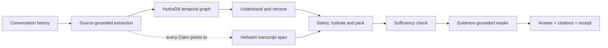

# Palimpsest

Palimpsest is a context retrieval and memory layer for AI agents, built on
[HydraDB](https://github.com/hydra-db/hydradb).

It turns long conversation histories into a temporal graph of facts, preferences, updates, and
source references. When an agent needs context, Palimpsest retrieves a small evidence pack and
answers only from the original transcript.

The goal is simple: give an agent useful long-term memory without repeatedly sending the full user
history to a model, while keeping every answer traceable to what the user actually said.

> **Current status:** validated research system and demo. Retrieval v2 passed its development gate;
> the full test evaluation and production security/runtime work are not complete.

## Why this exists

Long-running agents need more than semantic search over chat messages. They need to understand:

- what is true now versus what used to be true;
- which facts must be combined to answer a question;
- whether the available evidence is sufficient;
- where every answer came from;
- and how to retrieve a small context window instead of the entire history.

Palimpsest models those concerns directly. Extracted Claims help find evidence, but the reader never
answers from those generated summaries. It reads verbatim transcript spans.

## Platform architecture



### 1. Ingest and source grounding

Conversation turns are stored verbatim. An LLM extracts indexable Claims, entities, attributes,
keywords, dates, and character offsets. Every Claim points back to a concrete span in a source turn.

### 2. Temporal graph

HydraDB stores Sessions, Turns, Claims, Entities, Slots, and Tokens. Explicit `SUPERSEDED_BY` edges
represent updates such as an old employer, address, or preference being replaced by a newer value.
Historical questions are answered using data-level `asOf` semantics.

### 3. Retrieval plan

For each question, Palimpsest:

1. identifies the route, time reference, sub-questions, and entity/attribute probes;
2. runs bounded HydraDB retrieval arms concurrently;
3. applies time and as-of rules;
4. uses listwise selection to retain the useful candidates;
5. hydrates the corresponding transcript spans or complete turns;
6. labels current and earlier statements and enforces a reader budget;
7. checks whether the evidence is sufficient, with at most one refined pass;
8. asks the reader to answer from that evidence and validates its citations.

### 4. Explainability

Each response includes evidence spans, cited IDs, retrieval decisions, model IDs, stage timings, and
a deterministic evidence hash. With a fixed graph and fixed LLM cache, evidence selection and model
outputs replay identically; timings can vary. First-run model decisions and extraction are still
model-dependent.

## Results so far

The current adoption result is from the predeclared 60-question LongMemEval-S development split:
54 answerable questions and 6 unanswerable `_abs` questions.

| System | Correct on answerable | Accuracy | Median reader input |
|---|---:|---:|---:|
| **Palimpsest v2** | **49 / 54** | **90.7%** | **890 tokens** |
| Palimpsest v1 | 43 / 54 | 79.6% | 3,658 tokens |
| Full context | 45 / 54 | 83.3% | 111,369 tokens |
| BM25 | 42 / 54 | 77.8% | 2,787 tokens |

Additional evidence:

- v2 versus v1: **+11.11 percentage points**, 95% CI **+1.19 to +21.03**;
- exact two-sided McNemar **p = 0.0703** over eight discordant pairs;
- v2 correctly handled **4 of 6** unanswerable questions, matching v1;
- warm HydraDB work measured **246 ms p50** for v2 on this split;
- median v2 reader context was about **1/125 of full context**.

These results are promising, not a final benchmark claim. The development sample is small, the
reported graph latency is warm graph time rather than first-touch or provider latency, and the v2
test split has not been run. The committed gate is in
[`results/gate-dev.md`](results/gate-dev.md); source rows are in
[`results/palimpsest-v2-dev.json`](results/palimpsest-v2-dev.json).

## What is built

- A typed HydraDB client with pagination, bounded writes, safe errors, causal bookmarks, and identity
  checks.
- Source-grounded transcript ingestion and temporal Claim/Slot indexing.
- The full retrieval-v2 stage pipeline and route-specific reader.
- Citation validation, sufficiency assessment, and one bounded second pass.
- A typed HTTP API and React demo for evidence, plans, receipts, slot history, and as-of replay.
- A LongMemEval harness with fixed dev/test splits, BM25/full-context/oracle baselines, paired
  statistics, result envelopes, batching, and table generation from JSON.
- A source-first transactional ingest foundation with immutable SourceRevisions, extraction/index
  generations, a durable manifest, and per-user commit locking.

## What remains

The main work before this can be called a production platform is:

- finish the 200-user benchmark population and run Palimpsest v2 on the held-out test split;
- complete the planned dev ablations, fast-profile measurement, and reader A/B;
- connect the transactional source/index-generation path to query-visible retrieval;
- make same-user live ingestion atomic and content-verified;
- establish a bounded cold-read and memory profile for HydraDB at multi-user scale;
- add authentication, tenant isolation, authorization, retention, deletion, quotas, and safe public
  error handling;
- strengthen receipts with source, generation, dataset, runtime, and prompt/cache identities;
- add CI, production packaging, health/readiness checks, and load, restart, and security tests.

The detailed retrieval plan and acceptance criteria live in
[`docs/spec-retrieval-v2.md`](docs/spec-retrieval-v2.md). Runtime findings, including cold-read and
memory limits, are recorded in
[`ops/hydradb/step-load-2026-08.md`](ops/hydradb/step-load-2026-08.md).

## Repository map

| Path | Responsibility |
|---|---|
| `packages/palimpsest` | Ingest, temporal graph model, retrieval plan, packing, sufficiency, reader |
| `packages/hydra` | Typed HydraDB client and graph identity boundary |
| `packages/llm` | OpenAI integration, structured output, caching, usage accounting |
| `packages/dataset` | Typed LongMemEval loading and normalization |
| `packages/eval` | Baselines, evaluation, statistics, gates, and result tables |
| `packages/server` | Effect HTTP API |
| `apps/demo` | React demo for answers, evidence, plans, receipts, and history |
| `ops/hydradb` | Reproducible benchmark runtime and operational evidence |

## Run locally

### Prerequisites

- Node.js 22 or newer
- pnpm 11.22.0, as pinned in `package.json`
- Docker Desktop with PowerShell for the HydraDB runtime
- an OpenAI API key for extraction and uncached reader calls
- LongMemEval data for benchmark commands

Install and verify the code that does not require a live node:

```powershell
pnpm install
pnpm test:unit
pnpm typecheck
pnpm demo:build
```

Create a gitignored `.env` in the repository root when running model-backed commands:

```dotenv
OPENAI_API_KEY=...
HYDRA_URL=http://127.0.0.1:8443
HYDRA_TOKEN=...
HYDRA_GRAPH=default
HYDRA_CELL=cell-0
```

Follow [`ops/hydradb/README.md`](ops/hydradb/README.md) to build and start the pinned HydraDB + MinIO
benchmark runtime. Do not attach that profile to an unrelated HydraDB volume.

With HydraDB running:

```powershell
pnpm test:live
pnpm serve       # API on http://localhost:8787
pnpm demo        # UI on http://localhost:5173
```

The LongMemEval files belong in the gitignored `data/` directory. Set `PALIMPSEST_DATA_DIR` to use a
different location. Evaluation and ingestion are deliberate, potentially long-running operations;
use the procedures in the runtime guide rather than treating them as quick-start commands.

## HTTP surface

| Endpoint | Purpose |
|---|---|
| `POST /users/:uid/sessions` | Ingest one query-visible conversation session |
| `POST /users/:uid/ask` | Retrieve evidence and return an answer, plan, receipt, and hash |
| `GET /users/:uid/sessions` | List the sessions used by the as-of timeline |
| `GET /users/:uid/slots/:skey` | Inspect a current/historical value chain |
| `GET /users/:uid/stats` | Inspect graph counts and contested slots |
| `POST /users/:uid/warm` | Prime one user's graph working set |

The API is currently a local demo surface. It does not yet provide authentication or tenant
isolation and should not be exposed as a public service.

## Design and evidence

- [`CONTEXT.md`](CONTEXT.md): domain vocabulary and measured HydraDB constraints
- [`docs/design-rationale.md`](docs/design-rationale.md): why the important invariants and constants exist
- [`docs/spec-palimpsest.md`](docs/spec-palimpsest.md): original product and graph design
- [`docs/spec-retrieval-v2.md`](docs/spec-retrieval-v2.md): current retrieval architecture and gate
- [`ops/hydradb/step-load-2026-08.md`](ops/hydradb/step-load-2026-08.md): runtime measurements and operating procedures
- [`docs/archive/`](docs/archive/): historical audits and remediation evidence

## License

No license has been declared yet.
