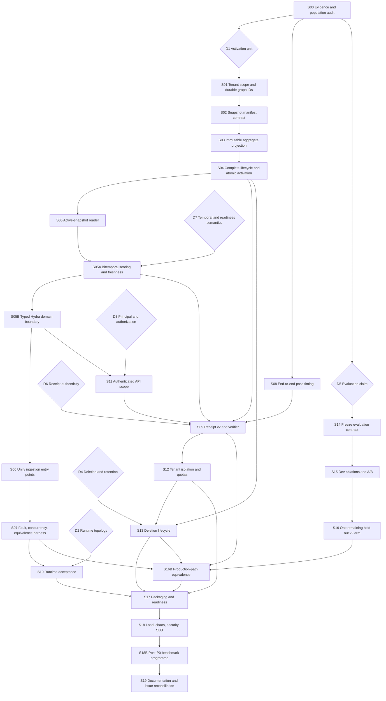

# Palimpsest implementation plan

Status: S00-S03 verified; D1-D7 are recorded in ADR-0003 through ADR-0009; implementation slices S04-S19 remain

Implementation baseline: committed code at `1445e77`, inspected and reverified 2026-09-19

Committed checkpoints: repository guidance `4ae686b`; S00 population evidence `44930d5`; S01 scoped graph identities `3449e39`; unit-test consolidation `a0025a8`; Effect v4, S02, and corrective hardening `9705c32`; S03 immutable aggregate snapshot graph `1445e77`. The vendor guidance change referenced by `4ae686b` is commit `3e6803a` inside `vendor/hydradb`.

Current local verification at `1445e77` (2026-09-19): `pnpm install --frozen-lockfile` passes, `pnpm lint` passes with zero findings, `pnpm test:unit` passes 66 files / 663 tests, `pnpm typecheck` passes, `pnpm demo:build` passes, and the staged implementation passed `git diff --check`. The recursive dependency graph contains only `effect@4.0.0-beta.107`; there is no Effect v3 compatibility package or fallback path. This is local contract evidence, not live HydraDB or production-readiness evidence.

Audience: a fresh implementation agent working one reviewable slice at a time

This plan turns the current retrieval-v2 findings and open GitHub work into a dependency-ordered execution checklist. It is deliberately stricter than the issue labels: several central components exist, but the current transactional index stops at `INDEXED` and is not query-visible. The retrieval-v2 **dev adoption gate did pass** on 2026-08-31; that result is separate from the still-open transactional/runtime production gate.

The destination is one coherent path from accepted source data to an immutable, tenant-scoped query snapshot, with atomic activation, reproducible receipts, bounded serving behavior, and honest evaluation evidence.

## Documentation authority

This file is the repository's only active implementation roadmap, requirements plan, execution
checklist, and status ledger. Add or revise slices here; do not create a second plan, spec, goal
prompt, remediation checklist, or status matrix.

Other documentation has narrower authority and must not be used to infer work order or completion:

- `CONTEXT.md` owns domain vocabulary and measured engine constraints.
- `docs/adr/` owns accepted architectural decisions.
- `docs/design-rationale.md` explains constants and invariants already represented in code.
- `ops/hydradb/` owns runtime procedures and measurements, not product readiness status.
- `docs/run-log.md` and committed `results/` are dated evidence records, not current plans.
- `README.md`, `docs/writeup.md`, and `docs/video-script.md` are explanatory surfaces and must link
  here instead of mirroring remaining work.

Prior specs, goal prompts, research roadmaps, and remediation checklists were removed from the active
checkout after their still-valid requirements were reconciled here. Git history remains the recovery
path for historical text. If another document conflicts with this plan, treat that as documentation
drift and correct the other document without silently changing this plan's contract.

## Current baseline and safety boundary

### Verified from the repository

- `TransactionalSourceIndex` persists source revisions and projection state, but explicitly rejects later lifecycle states and returns `queryVisible: false`.
- The manifest already models source revisions, canonical-view activation, projection reconciliation, generation metadata, and commit locks. Extend these foundations instead of building a second manifest.
- `Ingest.ts` is a separate legacy path. Its session-only existence check, mutable ordinal calculation, and read-modify-write counters are not a safe concurrent commit protocol.
- S01 made every new-plane source and index graph key tenant-scoped through validated, length-framed `MemoryScope` identity. Legacy bare-`uid` keys remain only behind the explicit benchmark/migration compatibility boundary; S02 added snapshot scope.
- An index generation identifies configuration/code. It is shared across sessions, so pointing a user directly at a generation cannot hide partial graph writes from a later session.
- The source-specific index graph is not the same shape as the legacy per-user token/slot query graph. Query visibility requires an aggregate immutable projection or an equivalent reader redesign.
- The repository now uses Effect `4.0.0-beta.107` throughout. Effect v4 `Schema` codecs validate Hydra success/error envelopes, datasets, persisted canonical artifacts, eval envelopes, runtime inspection, provider model discovery, demo API responses, and the S02 snapshot descriptor at their owning boundaries. Subsequent slices must extend these codecs directly; do not add casts, manual `unknown` walkers, `@effect/schema`, or any Effect v3 compatibility layer.
- The Hydra protocol boundary now owns recursive JSON request values and typed response decoding, but production callers still import raw graph operations. This is useful groundwork for S05B, not evidence that its domain-operation/import-boundary acceptance criteria are complete.
- The answer path reports only the final ask/read timing. The first retrieval pass and sufficiency decision are not represented end to end.
- Existing receipts omit enough identity, completeness, and replay information that they are not yet audit artifacts.
- S00 replaced the unsupported scalar population claim with a schema-validated, fail-closed audit. A read-only exact session-key reconciliation on 2026-09-11 found 164/200 users fully query-visible under legacy prefix `g3`, 36 missing, and zero partial. All 60 dev users are complete; 104/140 original test users are complete. The split is therefore recorded as `capacity-capped` with 36 reason-coded exclusions.
- The original 60/140 split lists remain immutable provenance because both halves have already been observed. `data/splits/population-*.json` derives the effective eligible membership after exclusions: dev 60, test 104. S14/D5 must define how the already-read 140-row baselines are subset/joined; do not silently rewrite the original split or ingest the 36 missing users.
- The dev adoption gate is immutable and passed at commit `4d45e09`: v2 produced 49/54 correct answerable rows versus v1's 43/54, with all six declared gate criteria passing. Do not re-read or overwrite that gate record.
- V1 and the premise variant were retired from live code at `d8a6e42`; their comparison authority is the `pre-cleanup-v1` tag plus the committed dev artifacts.
- The BM25, full-context, and oracle-session test baselines were already read once and committed at `422f021`. Do not rerun them as though the test split were untouched. The remaining one-time graph arm is Palimpsest v2.
- `results/table-dev.md` and `results/table-test.md` are currently untracked generated views. Treat the committed JSON/gate record as evidence authority until those tables are reviewed and intentionally added; file presence is not publication.
- The post-cleanup v2 dev semantic replay recorded in `docs/run-log.md` is still pending. It must prove byte-identical evidence/model outputs before the pre-cleanup gate can qualify the cleaned implementation for the remaining test arm.
- The dev result demonstrates promising retrieval quality, not production readiness. Retrieval-v2 has not been evaluated on the held-out test split by Palimpsest v2, and the checked-in test baselines do not prove that the graph population is complete.

### Runtime observation

Docker Desktop reports server version 29.7.2. For S00, the existing benchmark object-store and HydraDB containers were started without recreation, queried only for exact `User -> HAS_SESSION -> Session.sess` membership, and stopped cleanly. The volume was not reset or written by the reconciliation; no ingestion, provider call, or evaluation was run.

Before any runtime work, follow [the August step-load procedure](../ops/hydradb/step-load-2026-08.md) and the frozen retrieval-v2 evidence contract below. Starting services is reversible; resetting the volume, ingesting data, or running paid evaluation requires explicit authorization.

## How the implementation agent should work

Treat every numbered slice below as a separate session-sized change unless the maintainer explicitly combines them.

For each slice:

1. Re-read this slice, its decision blockers, and the linked source/tests.
2. Inspect the current branch and diff before editing. Preserve `data/`, `.cache/llm/`, `.palimpsest/`, the HydraDB volume, and unrelated worktree changes.
3. State the intended contract and failing tests first.
4. Change only the files needed for that contract.
5. Run the affected unit tests and `pnpm lint`. Run `pnpm typecheck` whenever types or contracts change.
6. Keep unit evidence separate from live evidence. Do not infer query visibility, restart safety, concurrency safety, or provider behavior from mocks.
7. Stop when a decision gate is unresolved or runtime/spend authorization is missing. Record what is known; do not choose a product policy silently.
8. If asked to commit, use the repository's `commit-work` skill and stage only this slice.

Do not reimplement issues merely because they are still open. For issues #24 through #31, compare every acceptance criterion with the current code, committed artifacts, issue comments, and the `pre-cleanup-v1` tag. Most core v2 code, the live arm/hydration probes, the demo plan panel, warm-on-select, the dev gate, and the S00 population audit already exist; the principal gaps are D5/S14 population-sensitive evaluation reconciliation, post-cleanup replay, missing dev artifacts, the Palimpsest-v2 test arm, and issue reconciliation.

### Two execution lanes that must not be conflated

The remaining work has two independent lanes:

1. **Retrieval-v2 evidence closure:** S00 is complete; S14-S16 must continue the `g3` experiment on the audited capacity-capped population. This lane does **not** depend on transactional snapshots, Receipt v2, authentication, deletion, or production packaging. Adding those blockers would contradict the frozen evidence contract below and risks consuming the held-out arm after unrelated architecture changes.
2. **Production memory plane:** D1-D4, D6-D7, S01-S13, S16B, and S17-S19 build and qualify the tenant-scoped transactional path. Evidence from the legacy `g3` experiment is a product-quality baseline, not proof that the new snapshot path preserves it.

The lanes join at S16B: the production path must reproduce the accepted retrieval contract on known data, or obtain a new evaluation approval under D5, before it can become a release candidate.

### Frozen retrieval-v2 evidence contract

This section is the only active contract for the legacy retrieval-v2 experiment. Algorithm details
already implemented are owned by executable code and behavior tests; this section freezes only the
population, evaluation, and claim boundary needed by S14-S16.

- The experiment uses the legacy query-visible `g3` graph. The transactional source/index path is
  not query-visible and must not be substituted into this lane.
- The originally selected population was 200 questions. S00 proved 164 users complete and 36
  missing, with zero partial users. Effective membership is dev 60 and test 104; the original
  60/140 split remains immutable provenance.
- The 2026-08-31 dev adoption gate is read-once evidence. Its predeclared checks were: v2 at least
  three more correct answers than v1 on 54 answerable questions; no question type worse by more than
  one; false abstention at most 10%; abstention accuracy on six `_abs` questions at least v1's;
  warm `graphMs` p50 at most 1.5 seconds; and reader input p50 at most 6,000 tokens.
- The gate passed at `4d45e09`. V1 is available only at tag `pre-cleanup-v1`; it is not a live
  checkout system. The reader remains `gpt-5.6-luna`, and final scoring uses the declared upstream
  `gpt-4o` judge protocol unless S14 records and approves a deviation before the remaining arm.
- BM25, full-context, and oracle-session already consumed the original 140-question test split at
  `422f021`. Their artifacts must remain byte-identical. Only Palimpsest v2 may be run on the 104
  eligible test users, exactly once and only after S14-S15 plus explicit runtime/provider approval.
- The test split is held out from v2 tuning but is no longer fully blind because baseline answers
  have been observed. Public wording must say so. A stronger blind quality claim requires the D5
  private-holdout path.
- Any change that can alter candidates, scope, selection, packing, sufficiency, reader input/output,
  or answer choice invalidates inherited gate qualification unless the full 60-user semantic replay
  is byte-identical under S14's frozen manifest.

## Wayfinding decision frontier

These are the choices that materially change the implementation path. Record each accepted decision in the repository before starting its dependent slices.

| ID | Decision | Recommended direction | Why it blocks work |
| --- | --- | --- | --- |
| D1 | What exactly becomes query-visible atomically? | Add a content-addressed `UserIndexSnapshot` (or `ActiveIndexSnapshot`) distinct from `IndexGeneration`. | Generation identity alone cannot isolate one user's partially written projection. S01-S06 depend on this. |
| D2 | What HydraDB topology and persistence contract is supported for serving? | Compare the four recorded serving alternatives below, prototype the smallest credible candidate, and accept only a topology that passes restart, concurrency, residency, and latency gates. | Current benchmark shutdown/history is not a production contract. S10 and S17-S18 depend on this. |
| D3 | Which authenticated principal supplies tenant and user scope, and where is authorization enforced? | Derive `tenantId` and `uid` from a verified server-side principal; never trust body/query scope. | API migration and tenant isolation cannot be accepted without a trust boundary. S11-S12 depend on this. |
| D4 | What are deletion, export, retention, legal-hold, and receipt-retention semantics? | Define scoped export, source tombstone, snapshot rebuild, physical purge, receipt retention, and failure-recovery rules together. | Immutable snapshots otherwise make lifecycle and data-subject behavior ambiguous. S13 depends on this. |
| D5 | How will the final quality claim and benchmark scope be described? | Treat the existing test split as held-out but not blind, disclose that its three baselines were already run, reserve a new private split if a blind claim is required, and use current v2 plus baselines for future scale runs rather than silently reviving retired v1. | Prevents evaluation wording, dataset handling, and #13's stale system list from drifting after results are seen. S14-S16 and S18B depend on this. |
| D6 | What makes a receipt authentic rather than merely self-consistent? | Prefer an asymmetric signature over the canonical receipt for independently verifiable artifacts; document an HMAC or externally anchored digest only if its narrower trust model is intentional. | A self-hash can be recomputed after tampering. S09 and any audit/replay claim depend on a verifier trust anchor. |
| D7 | What do recorded time, valid time, completeness, and freshness mean? | Model recorded time separately from a precision-aware valid-time interval; define the API's recorded/valid/bitemporal perspectives, version historical scoring statistics, and state the readiness level a query requires. | F-22, F-38, and F-43 cannot be closed by a snapshot pointer alone. S05A, S08-S09, S13, and S17-S18 depend on this. |

### D1 option record

The maintainer should explicitly select one option:

| Option | Shape | Trade-off |
| --- | --- | --- |
| A. User snapshot, recommended | `IndexGeneration` describes the builder; `UserIndexSnapshot` identifies one immutable, verified projection and is the target of an active pointer. | Clear atomicity and replay identity; adds schema and snapshot lifecycle work. |
| B. Extend generation | Make every generation unique per tenant/user/source-set and point the user at it. | Fewer nouns, but conflates deploy/config identity with data-release identity and multiplies generations. |
| C. Active allowlist | Keep shared graph writes and atomically publish an allowlist of committed source revisions. | Smaller write change, but every query must apply complete allowlist filtering and prove no traversal leaks inactive nodes. |

If D1 selects option A, define snapshot identity from a canonical encoding of at least:

```text
tenantId
uid
indexGenerationId
canonicalViewId
ordered committed sourceRevisionIds
manifestSchemaVersion
```

All snapshot graph keys must include tenant and snapshot scope. Activation must occur only after graph write, read-back verification, and manifest commit succeed.

Keep callers independent of the selected D1 representation. The boundary should have the equivalent of:

```text
buildSnapshot(scope, orderedCommittedRevisions, generation, canonicalView) -> VerifiedSnapshot
activateSnapshot(scope, expectedManifestVersion, expectedActiveSnapshotId, verifiedSnapshotId) -> ActiveSnapshot
resolveQueryContext(principal, requestedUser, temporalCut, minimumReadiness) -> QueryContext
```

`QueryContext` is the only object retrieval/hydration needs; it carries scope, snapshot/projection identity, canonical view, scoring statistics, temporal cut, watermark, completeness, and causal floor. SQLite transactions, graph root keys, allowlists, and retry mechanics remain hidden. Option A best localizes those invariants; option B increases lifecycle coupling, and option C increases every read caller's filtering burden.

### D2 candidate record

Compare these four alternatives against the same declared workload and persistence contract:

1. A corrected or newer HydraDB runtime with bounded cold-read residency.
2. Physical partitioning that prevents one node from intermingling every user's working set.
3. A separate bounded candidate index for serving while HydraDB retains required graph semantics.
4. A different persistence/read engine for the serving path.

Record rejection evidence as well as the selected option. A warm p50 is not sufficient if the required warm set cannot fit within the supported memory envelope.

Evaluate each D2 candidate behind the same S05B domain contract and the same caller workload. A normal caller should ask for a `QueryContext`, bounded candidates, and source-span hydration without knowing whether the selected adapter uses one HydraDB node, partitions, a side index, or another engine. Candidate-specific lifecycle, paging, cache, retry, and diagnostic behavior stays behind the adapter; any candidate that forces storage-specific branching into retrieval is a design cost recorded in the comparison.

### D4 deletion and retention record

The current HydraDB graph cannot support in-place `DETACH DELETE` at the observed edge scale. D4 must therefore choose and prove one of: rebuild-and-swap into a fresh physical namespace/store, tenant-isolated store destruction, a serving engine with bounded deletion, or an explicitly limited logical tombstone policy. A tombstone or loss of query visibility is not physical erasure. If backups, object-store history, caches, prompts, receipts, or provider-retained content cannot be purged within the promised SLA, the product contract must say so.

### D6 trust record

The receipt design must name its attacker, verifier, key owner, rotation/revocation behavior, and verification lifetime. A canonical self-hash remains useful as a checksum but is not, by itself, evidence that an authorized producer issued an unchanged receipt.

### D7 temporal and readiness record

Record all of the following before implementing the temporal contract:

- which fields are source-recorded time, ingest/transaction time, valid-from, valid-to, precision, uncertainty, and supersession-effective time;
- whether each API operation asks for recorded-time, valid-time, or bitemporal state, including the exact meaning of `asOf`;
- how late-arriving and conflicting facts behave and when a correction becomes current;
- which immutable per-snapshot `N`/`df` statistics rank an historical query so future sessions cannot change an earlier result;
- which watermark (`SOURCE_DURABLE`, `INDEXED`, `ENRICHED`, `CONSOLIDATED`, or `COMMITTED`) is required by each read, and whether any lower-readiness fallback is supported;
- when incomplete/capped memory produces `INCOMPLETE_MEMORY` or another explicit non-answer instead of an absence claim.

## Dependency map



Safe parallelism is limited:

- S08 can run after S00 while D1 and snapshot work proceed.
- D2, D3, D4, D5, D6, and D7 can be decided in parallel because they are policy/prototype gates.
- S11 can start after D3 and the reader contract stabilizes, but its acceptance still depends on tenant-scoped data paths.
- Do not run S16 in parallel with work that changes retrieval, prompts, models, dataset membership, or receipt semantics.
- S14-S16 may proceed before S01-S13 only against the frozen legacy `g3` contract. S16B, not the old result alone, qualifies the production snapshot path.

## Layer and module ownership

This inventory prevents a slice from adding a parallel abstraction or overlooking an existing owner. Names in the final column are cohesive responsibilities, not a requirement to create one file per noun.

| Layer | Existing source of truth | Required owner/change |
| --- | --- | --- |
| Domain vocabulary and invariants | `CONTEXT.md`, `docs/design-rationale.md`, ADRs 0001-0002 | Record D1-D7 and add an ADR when a decision changes a durable boundary. |
| Scope, source, and generation identity | `SourceIdentity.ts`, `SourceTranscript.ts`, `IndexGeneration.ts`, `GenerationConfig.ts` | Add one validated `MemoryScope`; keep source revision, extraction generation, index generation, and snapshot identity distinct. |
| Manifest/control plane | `IngestManifest/{Types,Schema,Rows,Revisions,Projection,Generations,CanonicalView,Artifacts,GraphClaims,Codec}.ts`, `IngestCommitLock.ts` | Extend this SQLite authority with a cohesive `Snapshots` operation module plus historical-statistics, readiness, deletion, and migration records. Keep durable graph-ID claims in the same authority; do not create a second manifest. |
| Transactional write plane | `TransactionalIngest.ts`, `TransactionalSourceIndex.ts`, `SourceIndexPlane.ts`, `SourceIndexing.ts`, `IndexGraph.ts` | Complete lifecycle work, aggregate snapshot build/verification, activation, resumability, and entry-point unification. |
| Query/answer plane | `Gather.ts`, `Rows.ts`, `Routes.ts`, `Arms.ts`, `TimeScope.ts`, `Select.ts`, `Pack.ts`, `Sufficiency.ts`, `Reader.ts`, `Answer.ts`, `Plan.ts`, `Retrieve.ts` | Bind one immutable query context, apply tenant/snapshot/time scope before every cap, preserve source-only evidence, and emit one trace contract. |
| Hydra adapter | `packages/hydra/src/{Client,Transport,Paging,Chunking,Classify,Identity,Cypher,Decode,JsonValue}.ts` | Build on the now schema-validated JSON/protocol boundary to expose typed domain operations to production callers; keep raw Cypher/MSPaths/rows and engine limits inside the adapter or an explicit admin/test escape hatch. |
| HTTP/security/demo | `packages/server/src/{Api,Handlers,ReceiptProjection,Server}.ts`, `apps/demo/src/` | Add principal verification, authorization, safe errors, limits, receipt projection, and tenant-safe UI/client contracts. |
| Evaluation/evidence | `packages/eval/src/{Population,PopulationAudit,Splits,Envelope,Row,Systems,Gate,Tables,ReaderAb,Results,Stats,RuntimeConfig}.ts`, eval bins, `data/splits/`, `results/` | Preserve the S00 audited population and already-read gate/test arms, produce missing artifacts, implement Receipt v2 replay/cost/protocol checks, and distinguish legacy from production-path evidence. |
| Runtime/operations/release | `ops/hydradb/`, `scripts/{phase,ingest-cycling,eval-batched,dev-programme,p0-*}.ps1`, root package scripts | Prove the selected topology, migrations, readiness, backups, capacity, two-dimensional scale, CI, and rollback. |

New public types should have one clear home. Recommended owners are `MemoryScope` in the domain identity layer, `QueryContext`/active snapshot resolution in the query boundary, `PassTrace` in the answer contract, and Receipt v2 canonicalization/verification in a dedicated receipt module. Avoid putting authentication, manifest transactions, or canonical serialization in route handlers.

## P0/P1/P2 finding traceability

This matrix is the completeness check against the severity review. A slice is not complete until each mapped row has acceptance evidence; broad thematic work does not close an individual row.

| ID | Original subissue | Plan owner |
| --- | --- | --- |
| P0-A1 | Transactional orchestration stops at `INDEXED`; complete `ENRICHED`, `CONSOLIDATED`, and `COMMITTED`. | S04 |
| P0-A2 | Atomically activate the query snapshot together with its generation and canonical-view identity. | D1, S02-S04 |
| P0-A3 | Bind every retrieval and hydration request to exactly one active snapshot. | S05 |
| P0-A4 | Reconcile manifest and Hydra state after partial failure, cancellation, and restart. | S04, S07 |
| P0-A5 | Retire or route the legacy ingest endpoint through the transactional plane. | S06-S07 |
| P0-B1 | Compare submitted canonical bytes/digest on retries; reject same-ID/different-content conflicts. | S06 |
| P0-B2 | Remove stats-derived ordinals and stale read-modify-write counters under concurrent ingest. | S06-S07 |
| P0-B3 | Replace role-omitting, delimiter-ambiguous SID hashing with versioned canonical framing. | S06 |
| P0-C1 | Establish the exact selected, committed, persisted, and evaluated population. | S00 |
| P0-C2 | Either complete every selected user with zero failures or declare the capacity-capped population while preserving original split provenance and deriving exact eligible membership. | S00 complete; S14 consumes it. |
| P0-C3 | Do not resume ingestion merely to make existing population metadata appear true. | S00 stop condition |
| P0-D1 | Treat cold-read latency, per-user residency growth, node failure, and projected wall time as architecture gates. | D2, S10, S18 |
| P0-D2 | Decide among corrected HydraDB, physical partitioning, a bounded side index, or another serving engine. | D2 |
| P0-D3 | Do not run another long benchmark before the runtime contract passes. | S10 and runtime/spend stop conditions |
| P0-E1 | Authenticate tenant/user identity and never trust caller-supplied scope. | D3, S11 |
| P0-E2 | Add authorization-negative and cross-tenant tests across every data surface. | S11-S12 |
| P0-E3 | Add quotas and rate limiting before expensive work. | S12 |
| P0-E4 | Define deletion, retention, legal hold, receipt retention, and tenant-scoped export. | D4, S13 |
| P0-E5 | Define audit policy and redact secrets, prompts, content, and internal diagnostics. | S11-S13 |
| P0-E6 | Enforce request/body/source/token/concurrency abuse bounds. | S12 |
| P0-E7 | Replace raw Hydra/provider reasons with stable safe errors and correlated internal logs. | S11 |
| P1-A1 | Accumulate all retrieval, read, hydration, and sufficiency passes at the orchestration boundary. | S08 |
| P1-A2 | Separate graph cold/warm state, cache hit/miss, provider latency, and total wall time. | S08 |
| P1-A3 | Project API receipts, eval rows, and tables from one timing contract rather than recomputing totals. | S08 |
| P1-B1 | Version the receipt schema and canonical serialization. | S09 |
| P1-B2 | Bind the authenticated principal and authorization policy/decision. | D3, S09, S11 |
| P1-B3 | Bind source revisions, active snapshot/generation, and canonical view. | S09 |
| P1-B4 | Bind dataset, run, code, lockfile, runtime, graph, object-store, and schema identities. | S09, S14 |
| P1-B5 | Record candidate caps, completeness, cursor exhaustion, and truncation. | S09 |
| P1-B6 | Record prompt, parser, tool, cache, and model hashes for every provider decision. | S09 |
| P1-B7 | Distinguish requested model alias from provider-resolved immutable model/version identity. | S09, S14 |
| P1-B8 | Authenticate the receipt with an explicit trust anchor; do not present a self-hash as a signature. | D6, S09 |
| P1-C1 | Disclose that the current test split is held-out but no longer fully blind, or create a new private holdout. | D5, S14 |
| P1-C2 | Freeze retrieval behavior and evaluation configuration at an exact commit before the held-out run. | S14 |
| P1-C3 | Invalidate and reapprove the freeze after any answer-selection change; measurement-only fixes must prove semantic identity. | S14 |
| P1-C4 | Produce the eight declared dev ablation artifacts. | S15 |
| P1-C5 | Produce the fast-profile artifact. | S15 |
| P1-C6 | Produce the reader-route A/B artifact on identical packed evidence. | S15 |
| P1-C7 | Produce v2 test results and final paired, per-type, error-class, and risk-coverage tables. | S16 |
| P2-A1 | Replace the process-local collision registry with a durable cross-process uniqueness claim. | S01 |
| P2-A2 | Document and test collision detection, quarantine, and rebuild/rekey recovery. | S01, S07 |
| P2-B1 | Reconcile the README, writeup, run log, cleanup replay, and historical/current status boundary. | S19 |
| P2-B2 | Reconcile issues #13-#32 criterion by criterion, including landed-but-unproven #25-#30 work. | S19 |
| P2-B3 | Add repository lint/format commands and CI gates alongside tests, typecheck, and build. | `pnpm lint` and deterministic anti-slop configuration complete; format and CI gates remain in S17. |
| P2-B4 | Add a production server image/deployment definition, migrations, health/readiness, backup, and rollback. | S17 |
| P2-B5 | Add load, chaos, security, capacity, recovery, and SLO evidence. | S18 |

## F-01 through F-45 traceability

This table, the P0/P1/P2 matrix above, and the mapped slice acceptance criteria are the complete active definition of the 45 findings. Historical remediation dossiers remain only in Git history and must not be restored as a parallel checklist.

| Finding | Plan owner | Finding | Plan owner |
| --- | --- | --- | --- |
| F-01 runtime/source identity | S10, S14, S17 | F-24 completion-conditioned population | S00, S14, S16 |
| F-02 executable work map | S19 | F-25 fair index/system ablations | S15, S18B |
| F-03 durable restart/write | S10, S18 | F-26 exact upstream judge protocol | S14, S18B |
| F-04 compaction/GC health | S10, S18 | F-27 paired uncertainty | S16, S18B, S19 |
| F-05 cache queue/drop bounds | S10, S18 | F-28 phase/cache latency | S08, S10, S15, S18 |
| F-06 resource/capacity gate | S10, S18 | F-29 reproducible cost definitions | S09, S14, S18B |
| F-07 safe typed engine errors | S10, S11, S17 | F-30 contamination/judge bias | D5, S14, S18B |
| F-08 explicit resumable commit | S04, S06, S07 | F-31 calibrated completeness states | S05A, S15, S18B |
| F-09 concurrent manifest/deltas | S02, S04, S06, S07 | F-32 premise decision calibration | S15, S18B |
| F-10 projection reconciliation | S02-S05, S07 | F-33 selection/reader loss | S15, S16, S16B |
| F-11 immutable canonical views | D1, S02-S05 | F-34 bounded slot expansion | S05, S05B, S15, S18 |
| F-12 entry-point equivalence | S06-S07 | F-35 adaptive retrieval shape | S05, S15, S16B |
| F-13 immutable source lineage | S01-S04 | F-36 vocabulary-mismatch sidecar | S18B, conditional |
| F-14 isolated active projection | D1, S02-S05 | F-37 structured span assessment | S15, S18B |
| F-15 derived text is not evidence | S05, S09, S11, S16B | F-38 bitemporal semantics | D7, S05A, S09 |
| F-16 durable collision detection | S01, S07 | F-39 authenticated tenancy | D3, S01, S11-S12 |
| F-17 typed Hydra boundary | S05B | F-40 deletion/retention lifecycle | D4, S13, S18 |
| F-18 request-scoped causal context | S05B, S07, S11 | F-41 two-dimensional scale | D2, S10, S18 |
| F-19 complete Receipt v2 | D6, S08-S09 | F-42 early high-degree bounds | S03, S05B, S12, S18 |
| F-20 HTTP plan round-trip | S09 | F-43 freshness/readiness contract | D7, S04, S05A, S17-S18 |
| F-21 candidate/hash completeness | S08-S09 | F-44 evidence-bounded claims | D5, S19 |
| F-22 historical scoring snapshot | D7, S05A, S09 | F-45 multi-source product evidence | D5, S18B, S19 |
| F-23 generated denominators | S00, S14 |  |  |

No finding is closed by this mapping. Each still needs the mapped slice's acceptance evidence or an explicitly approved non-goal recorded in this plan.

## Open issue reconciliation map

GitHub issue state is current as of 2026-09-10, but several bodies/comments lag the code. S19 may update or close issues only when that external mutation is explicitly authorized.

| Issue | Current code/evidence boundary | Remaining plan owner |
| --- | --- | --- |
| #13 full 500/writeup/video | Writeup, README, and video script exist; the 500 run and recorded-video link do not. | S18B, S19; human recording owner required. |
| #14 F-01-F-45 map | Parent remains open; closure is criterion-by-criterion, not by test count. | All mapped slices, then S19. |
| #15 runtime F-01-F-07 | F-01/F-03/F-06/F-07 have partial historical evidence; compaction/GC and enabled-cache/load SLOs remain. | S10, S18, S19. |
| #16 ingest F-08-F-16 | Manifest/source/generation foundations exist; active query-visible commit and live fault/concurrency evidence do not. | S01-S07, S19. |
| #17 Hydra/receipts F-17-F-22 | Fiber-local causal context and Query-1 projection exist; typed domain boundary, historical statistics, complete Receipt v2/replay remain. | S05A-S05B, S07-S09, S19. |
| #18 retrieval F-23-F-31 | Partly superseded by retrieval v2; semantic/late-interaction work was deliberately deferred. | S15, conditional S18B, S19. |
| #19 policy/reader F-32-F-37 | V2 route/select/pack/sufficiency code exists; broader calibration and controlled evidence remain. | S15, S18B, S19. |
| #20 tenancy/privacy F-38-F-40 | No authenticated tenant boundary, bitemporal contract, or deletion lifecycle. | D3-D4, D7, S01, S05A, S11-S13, S19. |
| #21 benchmark/scale F-41-F-45 | No two-dimensional scale or multi-source product evidence. | S18, S18B, S19. |
| #22 retrieval-v2 parent | Dev gate and S00 population audit passed; Palimpsest-v2 test arm and declared missing artifacts remain. | S14-S16, S19. |
| #23 runtime/population | S00 replaced `ingested=200` with an exact legacy-session witness: 164 complete, 36 missing, zero partial; effective dev/test membership is 60/104. Broader runtime gates remain separate. | S14, S16, S19. |
| #24 concurrent read path | Four dependency levels and optional-arm timeout semantics were proposed deviations; v1 live probe was later removed with v1. | S08, S14, S19; retain historical evidence or formally supersede criteria. |
| #25 harness foundations | Split/gate/table/baseline machinery, dev results, and fail-closed population reconciliation exist; the remaining artifacts must consume the 60/104 eligible membership exactly. | S14-S16, S19. |
| #26 Understand | Code and dev result exist; the impossible “Understand active but v1-identical” criterion needs the proposed measurable substitute recorded. | S15, S19. |
| #27 arms/time scope | Code and live probes exist; declared ablation artifacts are missing. | S15, S19. |
| #28 select/pack | Code and repeated-SID/whole-turn probe exist; provider-token budget calibration and declared ablations are missing. | S15, S19. |
| #29 sufficiency | Code, risk-coverage output, and chosen empty abstain tier exist; the no-sufficiency artifact is missing. | S15, S19. |
| #30 reader | Route/citation/prompt code exists; the committed reader A/B evidence artifact is missing. | S15, S19. |
| #31 models/profile/demo | Model checks, profiles, plan panel, and warm-on-select exist; the fast-profile/cold-warm acceptance artifact still needs reconciliation. | S08, S15, S19. |
| #32 adoption/test | Dev gate passed and v2 became the live path; the Palimpsest-v2 test arm and ablation summary are missing. | S14-S16, S19. |

## Implementation slices

### S00: Audit evidence and the split population

**Status:** complete and verified on 2026-09-11. Do not reimplement this slice unless its inputs or acceptance contract change.

**Goal:** replace unsupported population metadata with a deterministic, fail-closed audit before any more ingestion or evaluation.

**Related findings/issues:** F-23/F-24; false population artifact; evaluation completeness; #13, #14, #16, #22-#25, and #32 as applicable.

**Primary areas:** `packages/dataset`, `packages/eval`, `data/splits/`, `results/`, dataset/split manifests.

**Checklist**

- [x] Locate every producer and consumer of `requested`, `ingested`, `capacityGateTripped`, answerable counts, and split membership.
- [x] Remove the `splits.ts` fallback that writes `ingested = requested` when no store reconciliation ran. Represent unverified ingestion as `unknown`/a declared state, not a successful numeric claim.
- [x] Define a canonical population record sourced from actual selected user/question IDs and witnessed query-visible ingestion records.
- [x] For the legacy `g3` graph, define a read-only completeness witness from exact query-visible session keys and selected source-session keys; label it legacy reconciliation because it is not a transactional `COMMITTED` manifest.
- [x] Include dataset hash/version, explicit split IDs, requested population, selected population, ingested population, answerable/abstention counts, exclusions with reasons, timestamps, and effective eligible membership.
- [x] Include evidence kind (`manifest-committed`, `legacy-query-visible`, `declared`, or `unknown`), verified-at time, legacy graph prefix/null snapshot identity, and the command/artifact that produced the count.
- [x] Make contradictory, stale, malformed, or missing counts/membership fail the CLI instead of defaulting to success.
- [x] Add unit fixtures for partial ingestion, duplicate IDs, excluded users, missing evidence, stale witnesses, capacity-gate contradictions, and evaluated-population mismatch.
- [x] Regenerate non-live metadata from existing immutable dataset, split, witness, and result artifacts without ingestion or provider calls.
- [x] Run the explicitly authorized read-only reconciliation against the preserved HydraDB volume, without recreating or writing the store.
- [x] Record the capacity-capped branch: preserve the original observed 60/140 split lists for provenance and derive effective membership by excluding the 36 users absent from `g3`.
- [x] Preserve all missing users with reason codes; never use `--skip-missing` to remove them silently from the denominator.
- [x] Mark downstream evidence stale whenever its evaluated IDs do not exactly equal the eligible membership; never edit historical metrics into consistency.

**Acceptance**

- A clean command can reproduce the population artifact from immutable inputs.
- The gate fails when selected, committed, and evaluated populations disagree.
- The artifact states whether it is dev, test, or another split and whether it has been observed during development.
- The artifact identifies whether the population is fully completed or capacity-capped and contains the deterministic membership used by every downstream result.
- No code path can serialize an unverified requested count as a verified ingested count.

**Verification:** affected dataset/eval unit tests plus `pnpm typecheck`.

**Evidence:** `data/splits/retrieval-v2.reconcile.json` records exact session-key observations for 200 selected users; `data/splits/retrieval-v2.json` records 164 verified, 36 missing, zero partial, and the capacity-capped branch. `data/splits/population-dev.json` passes for all 60 eligible/evaluated dev users. `data/splits/population-test.json` intentionally fails closed because the Palimpsest-v2 test result does not yet exist for the 104 eligible test users.

**Verified commands:** `pnpm splits --check`; `pnpm splits --gate-tripped`; `pnpm population --split dev --results results/palimpsest-v2-dev.json` (exit 0); `pnpm population --split test --results results/palimpsest-v2-test.json` (expected exit 1 with 104 unevaluated eligible IDs); `pnpm test:unit`; `pnpm typecheck`.

**Stop condition reached and resolved:** live store inspection was required and completed read-only. Further ingestion remains prohibited until the applicable P0 runtime/ingest gate passes and is explicitly authorized.

### S01: Introduce tenant-scoped memory identity and durable graph-ID claims

**Status:** complete and verified on 2026-09-11.

**Goal:** make cross-tenant key collision impossible by construction in the new transactional plane.

**Prerequisite (satisfied):** D1.

**Primary areas:** `SourceTranscript.ts`, `IndexGraph.ts`, `IngestManifest/*`, Hydra ID helpers and their unit tests.

**Checklist**

- [x] Define one branded `MemoryScope` carrying `tenantId` and `uid`; validate both at external boundaries.
- [x] Change new-plane transcript, revision, token, slot, claim, and relationship key builders to accept `MemoryScope` rather than a bare user ID. Snapshot keys begin in S02, where the snapshot type is introduced.
- [x] Use canonical length-prefixed or structured encoding, not delimiter-free concatenation.
- [x] Store the full canonical identity alongside any reduced numeric Hydra identifier.
- [x] Add a manifest-backed claim table with a unique constraint on reduced graph ID and canonical identity.
- [x] Acquire/verify the durable identity claim before the corresponding graph upsert; never discover a conflict only after ambiguous data may have been merged.
- [x] Treat same-ID/same-identity as idempotent and same-ID/different-identity as a hard collision.
- [x] Ensure claims recover across process restart. Snapshot metadata recovery belongs to S02, where snapshot persistence is introduced.
- [x] Add negative tests for equal user IDs in different tenants and a deterministic forced-collision test.
- [x] Define collision quarantine plus rebuild/rekey recovery so detection never leaves ambiguous graph data query-visible.

**Acceptance**

- No new-plane graph key helper can be called without tenant scope.
- Concurrent processes cannot claim the same reduced ID for different identities.
- A detected collision is quarantined, observable, and recoverable through a tested rebuild/rekey procedure.
- Existing legacy keys remain readable only through an explicit compatibility boundary; there is no implicit fallback on writes.

**Verification:** source transcript, index graph, Hydra ID, and manifest unit tests plus `pnpm typecheck`.

**Verified implementation and evidence (2026-09-11):** new writes use a tenant-scoped `MemoryScope` root and never call the legacy bare-`uid` User writer. Revision identities use length-prefixed framing, and schema version 9 rewrites earlier delimiter-joined revision keys in place. Before claiming a new write, the claim path performs a label/type-agnostic Hydra identity lookup; this lazily adopts pre-S01 full identities into the durable manifest and quarantines any mismatch before upsert. Reduced IDs must match their canonical identity. Recovery derives a replacement ID from a changed canonical namespace, runs the rebuild, verifies the stored full identity, and only then resolves quarantine. The persistence test launches two operating-system processes concurrently against one SQLite manifest and observes exactly one claim plus one quarantined collision.

**Verified commands:** focused S01/Hydra/manifest unit suite (9 files, 48 tests); `pnpm test:unit`; `pnpm typecheck`; `git diff --check HEAD`. No HydraDB container, ingestion, provider, evaluation, cache, or persistent-volume mutation is required for S01.

**Design constraint retained:** revisit this slice if D1 changes the snapshot/key namespace or the manifest can no longer provide the required transaction/uniqueness guarantee.

### S02: Add the immutable user-snapshot manifest contract

**Status:** complete, reverified, and committed at `9705c32` on 2026-09-19.

**Goal:** represent a verified per-user projection separately from configuration generation.

**Prerequisites (satisfied):** S01 and D1 option A. Rewrite this slice explicitly if the maintainer replaces D1 with option B or C.

**Primary areas:** `IngestManifest/Types.ts`, `Schema.ts`, `Codec.ts`, `Rows.ts`, a cohesive new `Snapshots.ts` operation module, `IngestManifest.ts`, and manifest unit tests.

**Checklist**

- [x] Add snapshot identity, lifecycle state, `MemoryScope`, generation ID, canonical-view ID, ordered revision set/hash, schema version, graph root IDs, counts, build attempt, and verification digest.
- [x] Define one Effect v4 `Schema` codec for the canonical snapshot descriptor and derive its TypeScript type from that schema. Parse persisted JSON at the manifest boundary; do not duplicate the contract as a hand-written interface plus assertion.
- [x] Define states such as `BUILDING`, `VERIFIED`, `ACTIVE`, `SUPERSEDED`, and `FAILED` with legal transitions.
- [x] Add immutable insert/read/list operations and an active-snapshot lookup by `MemoryScope`.
- [x] Add one SQLite transaction that validates a verified snapshot and compare-and-swaps the active pointer.
- [x] Preserve the previous active snapshot until the terminal transaction commits.
- [x] Specify idempotency for a repeated identical build and conflict behavior for a different payload under the same ID.
- [x] Add a forward-only migration from the current SQLite `user_version = 9` to the S02 schema version, including restart coverage and codec tests for malformed/old rows.

**Acceptance**

- A crash before activation leaves the old snapshot active.
- A repeated terminal commit is idempotent.
- Competing activations have a deterministic winner or explicit conflict; no mixed active state is observable.
- Snapshot content is reconstructible from its manifest row without reading mutable session counters.

**Verification:** focused manifest snapshot/codec/migration/restart/concurrency tests, then `pnpm lint`, `pnpm test:unit`, `pnpm typecheck`, and `git diff --check`. No HydraDB container, provider, ingestion, evaluation, cache clearing, or volume reset is required for S02.

**Verified implementation and evidence (2026-09-13):** `UserIndexSnapshot.ts` owns the single Effect v4 `Schema` descriptor codec (`UserIndexSnapshotDescriptorSchema`), derives its type, and content-addresses `snapshot-v1-<sha256>` over canonical JSON covering tenant/uid scope, index-generation ID, canonical-view ID, ordered committed revision IDs, and manifest schema version. Its public constructor returns a parsed `Result`, so duplicate/empty revision IDs and other invalid descriptors cannot escape as `UserIndexSnapshot`. `IngestManifest/Schema.ts` moves the manifest to `user_version = 10` with additive `user_index_snapshots`, `user_index_snapshot_revisions` (ordered membership), and `active_index_snapshots` (per-scope pointer) tables; opening a schema newer than version 10 fails before migration pragmas run and preserves the future version. `IngestManifest/Snapshots.ts` implements idempotent register, verify, fail, read, list, read-active, and a single `BEGIN IMMEDIATE` activation transaction that validates scope, lifecycle state, listed-revision COMMITTED status, complete committed-revision coverage, `expectedManifestVersion`, and `expectedActiveSnapshotId`. The active-pointer precondition makes competing activations from the same observed state produce exactly one successful writer and an explicit conflict for the loser before the previous pointer can be superseded. Registration rejects identity/content mismatches and foreign-scope bindings; verification evidence is stored once and conflicts on divergence; `FAILED -> BUILDING` reopens with an incremented build attempt. Snapshot graph data is not query-visible; no reader or ingestion path is wired to activate or consume snapshots.

**Verified commands (rerun 2026-09-19 and committed at `9705c32`):** focused snapshot suite `packages/palimpsest/test/unit/user-index-snapshot.test.ts` (14 tests: identity/content addressing, constructor/parser invariant agreement, canonical-JSON round-trip and malformed encodings, idempotent register/verify/fail, lifecycle transitions and illegal-transition rejection, active-pointer CAS with supersede/rollback/idempotent retry, stale-version conflict, uncommitted and uncovered-revision rejection, restart survival, v9->v10 migration, future-version refusal without downgrade, corrupted-row availability, and a two-process race with exactly one successful competing activation); focused Hydra decoding/causal suites (8 tests: strict successful envelopes and discriminated cells, row-width rejection, request-scope isolation, and independent-runtime isolation); `pnpm install --frozen-lockfile`; `pnpm test:unit` 65 files / 641 tests; `pnpm typecheck`; `pnpm lint` zero findings; `pnpm demo:build`; staged implementation `git diff --check` clean.

**Future-slice ownership check (2026-09-13):** S04 still owns end-to-end commit/build/activation orchestration and fault injection; S05/S05B/S07 still own active-only reads, removal of raw Hydra imports, and cross-target/cross-replica causal qualification; S17 still owns deployment locking, backup, and rollback. Those later responsibilities do not defer S02 pointer CAS or forward-version safety, nor do they permit regressions in the current Hydra and Effect service foundations.

### S03: Build and verify the immutable aggregate snapshot graph

**Goal:** materialize a complete query-shaped projection without exposing it to readers.

**Blocked by:** S02.

**Primary areas:** `IndexGraph.ts`, `SourceIndexPlane.ts`, `SourceIndexing.ts`, canonical-view/projection services, retrieval graph queries, Hydra write/read helpers.

**Checklist**

- [x] Specify the aggregate snapshot node/edge schema consumed by retrieval: tokens, slots, claims, source/revision provenance, and causal links.
- [x] Make every graph identity tenant-and-snapshot scoped.
- [x] Build only from committed source revisions listed in the snapshot manifest.
- [x] Define deterministic ordering, deduplication, supersession, and canonical-entity behavior across multiple sources.
- [x] Write in bounded chunks with retry-safe upserts and explicit cardinality expectations.
- [x] Read back roots, counts, revision coverage, and a deterministic projection digest.
- [x] Mark the snapshot `VERIFIED` only when read-back checks pass.
- [x] Leave active-snapshot state untouched on any graph or verification failure.
- [x] Add fixtures proving source-order independence and no cross-snapshot traversal.

**Acceptance**

- The same canonical input produces the same snapshot identity and digest.
- Partial writes are unreachable through the active reader.
- Read-back detects missing revisions, nodes, or edges before verification.
- Rebuilding an identical snapshot is idempotent.

**Verification:** index-graph, source-indexing, canonical-view, and Hydra statement/unit tests plus `pnpm typecheck`.

**Live evidence deferred:** a real HydraDB write/read/restart probe belongs to S07 and requires an isolated authorized runtime.

**Verified implementation and evidence (2026-09-19, committed `1445e77`):** `SnapshotGraph.ts` owns the S03 aggregate graph. `planSnapshotGraph` is a pure, source-order-independent planner: it orders manifest-listed commit ids, rejects missing/unlisted/duplicate/uncommitted/out-of-scope revisions and extraction-generation, artifact-binding, source-session, evidence-span, canonical-view, and causal-link violations, collapses equal claims inside a revision while keeping revisions distinct, resolves entities through the pinned canonical view, aggregates slots and token document frequency across revisions under the shared tokenizer cap, emits canonical-name edges, and stamps caller-decided `SNAPSHOT_SUPERSEDED_BY` links with the newer claim's session ordinal. Every key is `scope|snap|<snapshotId>|...` framed, so namespaces cannot traverse across snapshots. `build` reads the snapshot record, rejects missing/FAILED snapshots, gathers each listed revision with its stored artifact and durable SourceSession row, claims every vertex and relationship identity in the manifest before writing, writes retry-safe MERGE batches in deterministic label/type order (Hydra chunks rows internally), then verifies under the write's causal bookmark: the root's full stored property set, the complete member namespace through HAS edges, and every `SNAPSHOT_*` relation touching any member in both directions are diffed against the plan, and the SHA-256 digest is re-derived from observed content before `verifyUserIndexSnapshot` records digest, graph roots, and counts. A repeated identical build re-derives the stored digest and returns without rewriting; divergent content under a non-BUILDING state conflicts. No activation, reader exposure, or live-service path is wired.

**Verified commands (rerun 2026-09-19 at `1445e77`):** focused suite `packages/palimpsest/test/unit/snapshot-graph.test.ts` (22 tests: digest determinism and source-order independence, tenant/uid/snapshot scoping, duplicate-claim collapse and revision distinction, canonical-view resolution and slot aggregation, claim-to-revision/source-turn evidence, token bounds and canonical naming, supersession ordering and endpoint/self/backwards rejection, revision-state/listing/scope rejection, canonical-view and span rejection, successful write/read-back/VERIFIED transition with the active pointer untouched, idempotent rebuild without rewriting, missing member and missing/unexpected/foreign-incoming relationship detection, pre-write graph-id collision, and missing durable source session); `pnpm lint` zero findings; `pnpm test:unit` 66 files / 663 tests; `pnpm typecheck`; `pnpm demo:build`; `git diff --check` clean.

**Future-slice ownership check (2026-09-19):** S04 still owns lifecycle orchestration, atomic activation, and fault injection across the commit boundary; S05/S05B/S07 still own active-only reads and the live HydraDB write/read/restart probe; causal/supersession links arrive as caller-supplied decided facts, so their derivation remains an S04 enrichment responsibility. A failed S03 build leaves the snapshot `BUILDING` for retry — `FAILED` marking on abandoned attempts stays with lifecycle orchestration.

### S04: Complete lifecycle orchestration and atomic activation

**Goal:** advance a source-index session through `ENRICHED`, `CONSOLIDATED`, and `COMMITTED`, activating only a fully verified snapshot.

**Blocked by:** S03.

**Primary areas:** `TransactionalSourceIndex.ts`, `TransactionalIngest.ts`, manifest services, projection/canonical-view services.

**Checklist**

- [ ] Write an explicit lifecycle transition table and error taxonomy.
- [ ] Resume safely from every durable state without replaying successful provider work unnecessarily.
- [ ] Separate source enrichment from per-user consolidation/snapshot build.
- [ ] Acquire the correct scope lock for consolidation and terminal activation.
- [ ] Verify source revision, canonical view, generation, snapshot projection, and graph digest before the terminal manifest transaction.
- [ ] Commit the revision and switch the active-snapshot pointer atomically, or define the exact compensating protocol if one database cannot own both records.
- [ ] Return `queryVisible: true` only after active-snapshot read-back confirms the new pointer.
- [ ] Preserve the prior active snapshot on provider, graph, manifest, cancellation, or process failures.
- [ ] Add fault injection at every boundary and state-transition contract tests.

**Acceptance**

- The happy path reaches `COMMITTED` and reports the activated snapshot.
- Every injected failure is resumable and exposes either the old complete snapshot or the new complete snapshot, never a mixture.
- Concurrent commits for the same `MemoryScope` cannot lose a source revision.

**Verification:** transactional source/index, transactional ingest, manifest, projection, and generation unit tests plus `pnpm typecheck`.

### S05: Read exclusively through the active snapshot

**Goal:** migrate retrieval and hydration to one deep active-snapshot boundary.

**Blocked by:** S04.

**Primary areas:** `Gather.ts`, `Rows.ts`, `Routes.ts`, `Arms.ts`, `TimeScope.ts`, `Select.ts`, `Pack.ts`, `Sufficiency.ts`, `Reader.ts`, `Answer.ts`, `Plan.ts`, `Retrieve.ts`, Hydra read queries, server handlers.

**Checklist**

- [ ] Add one service that resolves `(principal -> MemoryScope -> active snapshot)` and supplies immutable query context.
- [ ] Require every retrieval query and hydration traversal to carry snapshot scope.
- [ ] Remove ambient/default tenant behavior from the new reader.
- [ ] Preserve source revision, canonical-view, generation, and snapshot provenance through candidate selection and citations.
- [ ] Keep generated Claim/index text explicitly derived and out of public evidence surfaces; every public evidence item must resolve to immutable source bytes and offsets.
- [ ] Define behavior for no active snapshot, superseded snapshot, corrupt pointer, and graph/manifest mismatch.
- [ ] Prove that activation between two requests changes the whole visible state, while activation during one request cannot mix snapshots.
- [ ] Put the legacy query-visible `g3` graph schema behind an explicit benchmark/migration adapter with telemetry and a removal condition. This is distinct from retired v1 retrieval; current v2 still reads the legacy graph shape.

**Acceptance**

- A request binds to exactly one snapshot at its start.
- Inactive and partially built graph data cannot appear in results.
- Two tenants with the same user ID cannot retrieve each other's data.
- Citations resolve to committed revisions in the bound snapshot.

**Verification:** retrieve, plan, select, reader-hydrate, citations, warm, and server contract unit tests plus `pnpm typecheck`.

### S05A: Implement bitemporal scoring, completeness, and freshness

**Goal:** close F-22, F-38, and the query-side half of F-43 with one explicit temporal/readiness contract.

**Blocked by:** D7 and S05.

**Primary areas:** source/manifest types, snapshot projection, `TimeScope.ts`, `Scoring.ts`, `Plan.ts`, query context, API schemas, temporal tests.

**Checklist**

- [ ] Persist recorded/transaction time separately from a precision-aware valid-time interval, uncertainty, source revision, and supersession-effective time.
- [ ] Make the request choose or unambiguously default a recorded-time, valid-time, or bitemporal perspective; preserve backward compatibility only through an explicit adapter.
- [ ] Materialize immutable per-snapshot historical `N`/`df` statistics, or another reviewed scoring state, and bind it to the query context.
- [ ] Apply tenant, snapshot, generation, recorded-time, valid-time, and as-of filters before every per-arm, union, traversal, and pack cap.
- [ ] Model late-arriving facts, uncertain dates, conflicts, corrections, and future-data isolation without rewriting source history.
- [ ] Carry source-durable/indexed/enriched/consolidated/committed watermarks and declared completeness into the plan and receipt.
- [ ] Define whether a query below its required watermark waits, returns a typed not-ready result, or uses a declared source-only fallback. Never report absence from an incomplete or capped search.
- [ ] Add property/table tests for future sessions not changing an earlier result and for recorded-time versus valid-time divergence.

**Acceptance**

- Adding a future or late-arriving source cannot change an earlier recorded-time answer/hash unless the selected policy explicitly says it should.
- Valid-time and recorded-time queries return the expected different answers on corrections and late arrivals.
- Every answer/absence states the snapshot, temporal perspective, watermark, caps, and completeness on which it depends.
- Freshness can be measured from source acceptance through each lifecycle watermark.

**Verification:** time-scope, scoring, snapshot, plan, receipt, and API unit tests plus `pnpm typecheck`.

### S05B: Deepen the Hydra boundary into typed memory operations

**Goal:** close F-17 without moving storage mechanics into every new caller.

**Blocked by:** S05A.

**Primary areas:** `packages/hydra`, `SourceIndexPlane.ts`, query/manifest adapters, production import boundaries, admin/test tooling.

**Current groundwork (2026-09-13):** Hydra request parameters now use recursive JSON protocol values; successful response envelopes require the vendored query fields, discriminate each supported cell tag from its value type, and reject row-width mismatches before projection; malformed successful responses become typed availability failures. Causal bookmarks are immutable `Context.Reference` values updated in the current fiber: sequential operations inherit the prior bookmark, independent runtimes start empty, and `withCausalBookmark` initializes an explicit request floor without sharing mutable state. Transport/classification/identity code no longer relies on manual `unknown` walkers. S05B remains open because raw `query`, `msPaths`, paths, rows, and storage-specific composition still reach production callers.

**Checklist**

- [ ] Trace every production caller of raw `query`, `msPaths`, rendered Cypher, decoded rows/paths, paging cursors, and scalar cell types.
- [ ] Expose cohesive operations for source/snapshot commit, active-context resolution, bounded candidate discovery/slot expansion, span hydration, and readiness/reconciliation.
- [ ] Keep paging, query IDs, bookmarks, retries, timeouts, payload limits, identity verification, collision handling, and safe engine error classification inside the adapter.
- [ ] Return domain records plus an opaque execution-plan/diagnostic handle, not Hydra rows or a Cypher builder.
- [ ] Move genuinely necessary unrestricted querying behind an admin/test-only boundary with separate authorization and audit policy.
- [ ] Preserve focused Hydra adapter tests for engine-specific invariants; add architecture/import tests preventing raw storage types from leaking back into production packages.
- [ ] Specify no-token, stale-token, cross-target token, and cross-replica causal behavior and test it with two users and two processes in S07.

**Acceptance**

- Production Palimpsest/server/eval code does not import raw Cypher renderers, Hydra rows/paths, or unrestricted query operations.
- Removing the adapter would spread engine-specific paging, causal, identity, and limit invariants across callers, demonstrating that the boundary is materially deep.
- Admin/test escape hatches cannot be reached by normal API principals.

**Verification:** Hydra adapter contract tests, architecture/import checks, affected query/write tests, and `pnpm typecheck`.

### S06: Unify batch, CLI, and live/API ingestion

**Goal:** make all supported ingestion entry points call the same transactional lifecycle.

**Blocked by:** S05B.

**Primary areas:** `Ingest.ts`, `Transcript.ts`, `ClaimGraph.ts`, `User.ts`, `Supersede.ts`, CLI bins, `Api.ts`/`Handlers.ts`, demo live-ingest client, `packages/eval/bin/ingest-slice.ts`, and ingestion drivers.

**Checklist**

- [ ] Inventory every ingestion entry point and its identity, retry, and response semantics.
- [ ] Route supported entry points through `TransactionalSourceIndex`/the completed lifecycle.
- [ ] Replace SID hashing based on date plus concatenated content with a versioned canonical framing that includes role, order, timestamp semantics, source identity, and tenant scope.
- [ ] Define source identity and idempotency keys at the API boundary.
- [ ] Remove mutable stats-derived ordinals and unguarded read-modify-write counters.
- [ ] Make repeated identical requests idempotent and conflicting payloads explicit errors.
- [ ] Delete the unsafe legacy write path only after equivalence coverage exists; otherwise feature-gate it off by default with a dated removal issue.
- [ ] Return durable lifecycle and snapshot identifiers, not an optimistic success based on session existence.

**Acceptance**

- Equivalent source input through supported entry points produces the same source revision and snapshot result.
- Same-content/different-role or different-order transcripts cannot collide.
- A successful API response identifies a committed, query-visible snapshot.

**Verification:** ingestion, source-identity, transactional, server handler, CLI, and demo contract tests plus `pnpm typecheck`; build the demo if its contract changes.

### S07: Prove fault safety, concurrency, restart, and entry-point equivalence

**Goal:** establish runtime evidence for the complete ingestion-to-query contract.

**Blocked by:** S06 and an explicitly authorized isolated runtime.

**Primary areas:** live tests/probes, `ops/hydradb/`, test fixtures, evidence output schema.

**Checklist**

- [ ] Define an isolated namespace/volume and record image digest, compose/config hash, machine resources, and clean/warm state.
- [ ] Test crash/restart after every durable lifecycle boundary.
- [ ] Race same-source retries, two different sources for one user, and same user ID across two tenants.
- [ ] Compare batch, CLI, and API outcomes by canonical manifest/snapshot digest.
- [ ] Verify old-or-new visibility during activation and no partial snapshot leakage.
- [ ] Restart the server, manifest process, HydraDB, and object store separately.
- [ ] Prove ID claims and active pointers survive process restart.
- [ ] Preserve the existing named volume unless the maintainer authorizes a disposable replacement; never reset it as test setup.
- [ ] Write a machine-readable evidence artifact with population, runtime, cache, retries, failures, and pass/fail assertions.

**Acceptance**

- All races converge or produce documented retriable conflicts without lost committed sources.
- Restart cannot turn an unverified snapshot active or lose the last active snapshot.
- All supported entry points are manifest-and-query equivalent.

**Verification:** affected unit suite first, then the authorized live probe following the ops procedure.

### S08: Capture full multi-pass timing and runtime conditions

**Goal:** make latency claims additive, attributable, and reproducible across every retrieval/read pass.

**Blocked by:** S00 only; coordinate contract changes with S05 and S09.

**Primary areas:** `Answer.ts`, answer/row types, `ReceiptProjection.ts`, eval row/table code.

The current `plan.stages`, `graphMs`, and `askMs` are the starting point. Preserve their measured meanings; add the missing first/second-pass and cache/runtime detail instead of introducing an unrelated telemetry model.

**Checklist**

- [ ] Define an orchestration-owned `PassTrace` for plan, retrieve, hydrate, sufficiency, reread, model, and total wall-clock phases.
- [ ] Use a monotonic clock for durations and wall time only for event timestamps.
- [ ] Record every pass, including an initial insufficient pass and final read.
- [ ] Record cache hit/miss, provider/model identity hash, prompt/config hash, snapshot identity, candidate counts/caps, token counts, and cold/warm conditions.
- [ ] Define additive totals once; projections and tables must not reconstruct partial totals independently.
- [ ] Preserve trace data on typed failures and abstentions.
- [ ] Add deterministic fake-clock unit tests and invariants such as total not less than child spans.

**Acceptance**

- A two-pass answer contains two complete pass records and one non-duplicated total.
- Server receipts and eval rows project from the same trace contract.
- Timing reports explicitly distinguish cold/warm and cache/provider conditions.

**Verification:** answer, rows, receipt-projection, eval row/table unit tests plus `pnpm typecheck`.

### S09: Define receipt v2, canonical hashing, replay, and tamper verification

**Goal:** turn a response receipt into a self-identifying audit and replay envelope.

**Blocked by:** S04, S05A, S08, S11, and D6.

**Primary areas:** receipt/domain types, `ReceiptProjection.ts`, handlers, eval envelopes and CLI tooling.

**Checklist**

- [ ] Version the receipt schema and canonical serialization.
- [ ] Include principal/scope, authorization policy/version/decision, request identity, active snapshot, generation, canonical view, manifest/source revisions, dataset/run identity, and runtime/config identity.
- [ ] Include all retrieval passes, candidate counts, caps, cursor exhaustion/completeness, selected evidence, citations, abstention/sufficiency decisions, and full timing trace.
- [ ] Include the requested model alias and the provider-resolved immutable model/version identity, plus prompt, tool, parser, and cache key/content hashes for every provider call. If the provider cannot supply a stable resolved identity, record that limitation and do not claim strict benchmark replay.
- [ ] Keep rendered prompts/source content in an access-controlled replay artifact store when required; receipts carry integrity references and redacted diagnostics, not secrets or cross-tenant content.
- [ ] Bind every evidence item to immutable source revision bytes/offsets and label all Claim text or summaries as derived index data.
- [ ] Hash the canonical receipt payload as an internal checksum; specify excluded volatile fields explicitly.
- [ ] Apply the D6 authenticity mechanism over the canonical receipt, including key ID, algorithm, issuance time, rotation/revocation metadata, and verification policy.
- [ ] Add structural, checksum, signature/MAC/anchor, wrong-key, revoked-key, and tamper-negative tests appropriate to the selected trust model.
- [ ] Add a replay command that can run in verify-only/cache-only mode without provider spend and clearly reports unavailable artifacts.
- [ ] Distinguish deterministic evidence/model-output replay from non-deterministic wall-clock timing.

**Acceptance**

- Changing any bound evidence, model, prompt, snapshot, or completeness field invalidates verification.
- Recomputing a checksum after modification does not produce a receipt accepted by the authenticity verifier.
- A fixed graph plus complete cache can reproduce selected evidence and model outputs byte-for-byte; timings are compared structurally, not byte-for-byte.
- Missing cache or source artifacts fail closed instead of silently calling a provider.

**Verification:** receipt, envelope, row, replay CLI, and tamper unit tests plus `pnpm typecheck`.

### S10: Select and prove the bounded serving runtime

**Goal:** close D2 with evidence, then establish the supported HydraDB/object-store operating envelope.

**Blocked by:** D2 and S07.

**Primary areas:** `ops/hydradb/compose.benchmark.yaml`, runtime configuration, Hydra client/probes, operations docs.

**Checklist**

- [ ] Prototype only the candidate topology required to answer D2; time-box it and record image/config digests.
- [ ] Tie the runtime image digest and build metadata to the exact reviewed HydraDB source revision and local patch fingerprint; reject `latest` or an untraceable build.
- [ ] Verify cold start, health, readiness, persistence, object-store behavior, clean shutdown, unclean restart, and schema/version compatibility.
- [ ] Run at least 20 clean write/restart/write cycles and 10 forced-kill/restart/write cycles without lease surgery or lost committed source.
- [ ] Run a sustained compaction/GC soak and a fault-injected maintenance test; record backlog, bytes pending, error counts, and last-success times and make stale maintenance visible to readiness.
- [ ] Exercise both the supported cache-off profile and an enabled-cache load profile; prove queue depth/drop rate, latency, and RSS stay inside a declared bound rather than assuming zero samples under a disabled cache close F-05.
- [ ] Set explicit timeouts, retries, concurrency, paging, payload, memory, disk, and connection limits.
- [ ] Classify retriable versus terminal transport/store failures.
- [ ] Measure bounded ingest/query workloads at declared population and cache state.
- [ ] Treat node cycling as an ingestion workaround, not a serving guarantee; reject a topology whose cold-read residency or per-user memory growth makes the declared steady-state workload unbounded.
- [ ] Define backup/restore and upgrade/rollback evidence requirements.
- [ ] Document the supported topology and reject unsupported modes in configuration.

**Acceptance**

- The chosen runtime survives the restart matrix without manifest/graph divergence.
- Health means process reachable; readiness means dependencies and required snapshot reads work.
- Resource and latency results identify population, concurrency, hardware, cache, and percentile method.

**Verification:** runtime/config unit tests first, then the explicitly authorized candidate prototype, restart matrix, cache profiles, and bounded load probes with immutable evidence artifacts.

**Stop if:** the packaged runtime cannot meet the minimum persistence/restart contract. Reopen D2 rather than masking it with retries.

### S11: Bind API scope to an authenticated principal

**Goal:** remove client-controlled/default tenant scope and enforce authorization at the server boundary.

**Blocked by:** D3 and S05B.

**Primary areas:** `Server.ts`, `Handlers.ts`, route schemas, configuration, server contract tests.

**Checklist**

- [ ] Verify credentials and derive a typed principal through one middleware/layer.
- [ ] Map principal claims to allowed tenant/user/resource scopes.
- [ ] Ignore or reject tenant/user IDs that conflict with the authenticated principal.
- [ ] Pass `MemoryScope` explicitly into every ingest, query, receipt, and administrative service.
- [ ] Replace permissive CORS with an environment-specific allowlist and safe defaults.
- [ ] Return stable public error codes; log internal causes with correlation IDs without returning raw exception reasons.
- [ ] Define auth-disabled local development behavior that cannot be selected accidentally in production.

**Acceptance**

- Unauthenticated, wrong-tenant, wrong-user, expired, and malformed credential tests fail closed.
- No handler constructs `tenantId: "default"` or trusts body/query tenant scope.
- Responses do not expose provider, graph, filesystem, or stack details.

**Verification:** server auth/handler/error tests plus `pnpm typecheck` and an authorized local smoke test if configured.

### S12: Prove tenant isolation and add abuse bounds

**Goal:** validate isolation across persistence, graph traversal, receipts, caches, logs, and resource use.

**Blocked by:** S11, S09, and S01.

**Primary areas:** server/palimpsest integration tests, cache keys, logging/metrics, request limits.

**Checklist**

- [ ] Build a two-tenant negative-test matrix using identical user, source, and content identifiers.
- [ ] Test ingest, query, citations, receipt fetch/replay, cache reuse, and administrative listing boundaries.
- [ ] Add request/body/source/token/concurrency/rate limits with explicit errors.
- [ ] Scope caches, idempotency keys, locks, graph-ID claims, and metrics labels safely.
- [ ] Propagate source ACL/ownership into derived snapshots and citations, and enforce it below route handlers so an internal caller cannot bypass it.
- [ ] Give the server, manifest, graph/object-store, backup, signing, and administrative identities separate least-privilege credentials and test denied operations.
- [ ] Redact source content, prompts, credentials, and provider bodies from default logs.
- [ ] Add audit events for denied cross-scope access and privileged operations.

**Acceptance**

- Every matrix cell either returns only authorized data or a stable denial/not-found result.
- Cache and receipt identifiers cannot be used as cross-tenant capabilities.
- Limits are enforced before expensive provider/store work where possible.

**Verification:** unit tests plus an authorized isolated integration run.

### S13: Implement scoped export, source deletion, snapshot rebuild, retention, and recovery

**Goal:** make data-subject export and immutable-history behavior match the approved D4 policy.

**Blocked by:** D4, D7, S04, and S12; coordinate with S09 receipt identity and retention.

**Primary areas:** manifest revisions/snapshots, graph projection, object/cache retention, admin API/CLI.

**Checklist**

- [ ] Define an authenticated, tenant-scoped export manifest covering source bytes, canonical metadata, active/superseded snapshot provenance, and receipts allowed by policy.
- [ ] Stream exports in bounded pages with integrity hashes, stable authorization errors, audit events, and no cross-tenant identifiers or cache leakage.
- [ ] Represent delete/tombstone intent durably and idempotently.
- [ ] Rebuild and activate a snapshot excluding deleted revisions before claiming query deletion.
- [ ] Define physical purge order across graph, manifest artifacts, caches, receipts, and backups.
- [ ] Preserve required legal-hold/audit references without leaving content query-visible.
- [ ] Make partial purge resumable and observable.
- [ ] Test deletion during ingestion, snapshot build, activation, query, and provider failure.
- [ ] Add retention sweeps with dry-run output and bounded batches.

**Acceptance**

- An authorized export is complete against its declared snapshot boundary, independently integrity-checkable, and contains no data from another scope.
- Deleted data is absent from newly bound queries after the policy's promised boundary.
- Failures cannot reactivate a snapshot containing data whose deletion was committed.
- Purge/retention actions produce verifiable, scope-safe audit records.

**Verification:** export, deletion, retention, manifest, snapshot, authorization, and recovery unit tests plus `pnpm typecheck`; then an explicitly authorized isolated lifecycle/restart probe.

**Stop if:** D4 cannot promise physical purge for a covered store or backup, or a failure can reactivate deleted content. Record the limitation or revise the approved policy before claiming completion.

### S14: Reconcile and freeze the remaining evaluation contract

**Goal:** preserve what was already read, prove the cleaned code still represents the passed gate, and prevent result-driven changes before the one remaining held-out graph arm.

**Blocked by:** S00 and D5.

**Primary areas:** this plan's frozen retrieval-v2 evidence contract, eval config/manifests, gate and result schemas.

**Checklist**

- [ ] Reconcile the frozen contract above with the audited population artifact, current implementation, `pre-cleanup-v1`, and the accepted issue deviations. Keep all evaluation requirements in this plan; do not create another spec or run checklist.
- [ ] Preserve the 2026-08-31 dev gate as read-once evidence. Do not delete, overwrite, or recompute its thresholds or result from newer code.
- [ ] Record that BM25, full-context, and oracle-session already consumed the 140-question test split at `422f021`; only Palimpsest v2 remains unrun on test.
- [ ] Freeze the S00 effective membership (dev 60, test 104) in the evaluation manifest. Derive 104-row baseline views from the immutable 140-row committed baseline artifacts without provider calls or overwriting them, and make every join fail on an ID outside or missing from the eligible set.
- [ ] Replay the cleaned current v2 implementation on all 60 dev questions against the same graph/cache and compare selected span bytes, span hash, model outputs, and final rows to `results/palimpsest-v2-dev.json`.
- [ ] If any semantic field differs, invalidate qualification of the old gate for current code and stop for a D5 decision; do not explain away a difference as “cleanup.”
- [ ] Freeze dataset/split IDs or hashes, exclusions, answerability rules, arms, prompts/models, rendered prompt/schema hashes, cache policy, retry policy, metrics, paired tests, and acceptance thresholds.
- [ ] Declare which dev/test data and baseline answers have already been viewed and what held-out/not-blind claim remains valid.
- [ ] Pin the exact upstream judge commit, endpoint/protocol, model snapshot, temperature/output cap, parser, and deviation policy. Keep any secondary judge or human adjudication separate.
- [ ] Define incremental session spend, clean-cache rebuild cost, marginal online cost, and amortized ingest cost using a versioned price manifest; never collapse them into one dollar figure.
- [ ] Add code/config/lockfile/image/runtime hashes to the run manifest.
- [ ] Require a clean immutable result directory and reject accidental overwrite/merge of unlike runs.
- [ ] Define invalid-run conditions before running.
- [ ] State that any post-freeze change capable of altering retrieval, packing, sufficiency, model input/output, or answer selection invalidates the freeze and requires a new reviewed manifest plus the D5 holdout decision.
- [ ] Permit a post-freeze measurement/infrastructure correction only when semantic replay proves identical selected evidence and model outputs across the entire frozen dev population.
- [ ] Obtain maintainer sign-off on the reconciled freeze before any Palimpsest-v2 test call.

**Acceptance**

- One manifest completely determines the remaining Palimpsest-v2 test arm and rejects drift before provider/store work.
- Current-code dev replay is semantically identical to the accepted gate, or current code is explicitly disqualified from using that gate until D5 is resolved.
- No acceptance threshold is computed or changed from the held-out outcome.
- The manifest identifies already-read arms and refuses to rerun/overwrite their canonical artifacts.

**Verification:** eval config, population, envelope, stats, gate, and table unit tests plus `pnpm typecheck`.

### S15: Run dev-only ablations and fast/reader A/B

**Goal:** fill the declared dev evidence gaps without re-reading the immutable adoption gate.

**Blocked by:** S14; runtime/spend authorization if cache misses or graph work are required.

**Primary areas:** eval arm configuration, retrieval metrics, reader A/B, dev result artifacts.

**Checklist**

- [ ] Inventory the committed v1/v2/baseline dev arms and reuse them; run only a required semantic replay or a missing named artifact. V1 runs only from `pre-cleanup-v1`.
- [ ] Produce all eight declared dev ablation artifacts on the identical audited population: `no-decompose`, `no-discovery`, `no-timescope`, `no-select`, `no-sufficiency`, `no-readerroute`, `granularity-span`, and `granularity-turn`.
- [ ] Produce the separate `profile-fast` artifact under the same comparison contract.
- [ ] Compare candidate recall, answer accuracy, abstention, tokens, timing, failures, and coverage on the same audited population.
- [ ] Produce the reader-route A/B artifact under identical packed evidence, model, cache, and judge conditions.
- [ ] Reconcile issue-specific acceptance evidence: four-level read dependency shape and optional-arm timeouts (#24); v1-preservation substitute (#26); Slot-probe/two-fact checks (#27); repeated-SID whole-turn probe and provider-token budget ratio (#28); chosen risk-coverage thresholds (#29); reader citation A/B (#30); and fast/full cold-warm latency plus demo warm/panel behavior (#31).
- [ ] Treat the checked-in live probes and UI/code as reusable evidence only when their runtime/config and assertions match the criterion; do not rerun them reflexively or rewrite already-landed behavior.
- [ ] Investigate every missing row or population mismatch before summarizing.
- [ ] Save immutable manifests, receipts, raw rows, tables, and gate output.

**Acceptance**

- The v2 gain is attributable to declared components rather than missing cases or unlike populations.
- All eight ablation artifacts, the fast-profile artifact, reader-route A/B artifact, budget calibration, and named live-probe records are present. If authorization or runtime feasibility prevents one, the slice remains incomplete and the evidence-closure report names the exact blocker.
- Regressions, timeouts, and abstentions remain in denominators according to the frozen contract.
- The final held-out run configuration is mechanically identical except for split identity.

**Verification:** eval arm/config/row/table/gate unit tests plus `pnpm typecheck`, followed only by the explicitly authorized dev replay, ablations, and A/B runs under the S14 manifest.

**Stop if:** the audited population, frozen configuration, graph identity, or semantic replay differs from S14, or required runtime/provider authorization is absent.

### S16: Execute the one remaining retrieval-v2 held-out arm

**Goal:** run Palimpsest v2 once on the 104-user S00-eligible test population and join it to 104-row views derived from the already-committed 140-row test baselines.

**Blocked by:** S14, S15, and explicit authorization for runtime/provider spend. S00 is complete. This legacy `g3` experiment is intentionally not blocked by S01-S13 because its exact 104-user eligible graph population is now witnessed. Additional ingestion is not part of this slice.

**Primary areas:** `packages/eval` run/preflight/join/table code, batched evaluation drivers, frozen manifests, `results/`, and `docs/run-log.md`.

**Checklist**

- [ ] Confirm the exact git SHA, clean intended diff, lockfile, dataset/split hash, runtime image/config, model/prompt IDs, cache state, and population.
- [ ] Verify the S00 witness and population hashes, then select exactly the 104 eligible test IDs. Fail if the graph/split/dataset identity changed; do not ingest the 36 excluded users in this slice.
- [ ] Run a preflight that performs no provider spend and fails on drift or missing prerequisites.
- [ ] Execute **only** Palimpsest v2 through the repository's batched cold-then-warm driver. Do not rerun BM25, full-context, or oracle-session, whose test artifacts already exist.
- [ ] Execute the frozen arm once. Do not tune, retry selected failures, silently use `--skip-missing`, or omit incomplete/error rows after observing results.
- [ ] Preserve raw rows, receipts, traces, logs, manifests, and gate output immutably.
- [ ] Derive 104-row baseline views from the exact committed 140-row artifacts, then join only after schema/population/runtime compatibility checks; never overwrite the originals or present the subset as a new baseline run.
- [ ] Report all predeclared systems and denominators, including errors and abstentions.
- [ ] Generate the final paired 2x2/McNemar and confidence-interval comparisons, per-type table, error-class table, risk-coverage table, and completeness summary from immutable result JSON only.
- [ ] If invalid-run criteria trigger, label the run invalid with evidence before deciding whether a rerun is permissible.

**Acceptance**

- The result artifact is complete, reproducible within the declared cache/runtime boundary, and passes schema/population integrity checks.
- Exactly one canonical 104-row Palimpsest-v2 test result exists; already-read 140-row baseline artifacts remain byte-identical and the derived comparison views name their exclusions.
- Any public claim uses only the predeclared gate and accurately labels the test split's held-out/not-blind status.

**Verification:** preflight, schema, population, join, stats, and table unit tests plus `pnpm typecheck`; then exactly one explicitly authorized Palimpsest-v2 test execution and artifact-integrity check.

**Stop if:** preflight detects drift from the S00 104-user eligible membership, the run becomes invalid, or runtime/provider authorization is absent. Preserve evidence without tuning, ingestion, or selective retry.

### S16B: Qualify the production snapshot path against accepted retrieval behavior

**Goal:** prove the new tenant/snapshot/temporal/receipt path preserves the intended v2 product behavior before packaging it as a release candidate.

**Blocked by:** S07, S09, S12, S13, and S16. If D5 chooses a new private holdout, follow that protocol instead of treating known test replay as new evidence.

**Primary areas:** transactional ingest/snapshot services, production query and hydration modules, Receipt v2, server authorization, eval parity tooling, and qualification artifacts.

**Checklist**

- [ ] Migrate or rebuild a declared fixture/population through the production transactional entry point; do not point the new reader at legacy graph records implicitly.
- [ ] Compare source bytes, active revision set, candidates before/after every cap, packed spans, citations, answer/verdict, temporal result, and Receipt v2 identity against the accepted v2 contract on known data.
- [ ] Prove batch/API/CLI entry-point equivalence, old-or-new activation visibility, restart recovery, and tenant isolation in the same qualification manifest.
- [ ] Run dev regression and the temporal/collision/deletion/authorization TCKs on the production path.
- [ ] Classify any known-test replay as regression evidence, not a second held-out benchmark.
- [ ] If production semantics intentionally differ, record the change, invalidate inherited quality claims, and return to D5 before release.

**Acceptance**

- The production path has complete runtime/receipt/security evidence and either semantic parity with the accepted retrieval behavior or a newly approved evaluation result.
- No release claim is backed solely by legacy `g3` or pre-snapshot code.

**Verification:** affected transactional/query/receipt/security unit tests plus `pnpm typecheck`, followed by the explicitly authorized isolated migration, parity, restart, isolation, and TCK qualification run.

**Stop if:** production-path evidence differs semantically from the accepted contract, source provenance cannot be matched, or a required runtime/evaluation approval is absent. Return to D5 rather than inheriting the legacy quality claim.

### S17: Package deployment, migrations, health, readiness, and rollback

**Goal:** make the accepted runtime reproducibly deployable without confusing process health with service readiness.

**Blocked by:** S10, S12, S13, and S16B for a release candidate.

**Primary areas:** container/build configuration, server startup, manifest migrations, ops docs, CI.

**Checklist**

- [ ] Produce pinned, non-root, minimal artifacts with dependency/image scanning and provenance.
- [ ] Validate configuration and secrets before listening.
- [ ] Run manifest migrations under an explicit lock with backup and rollback instructions.
- [ ] Separate liveness, startup, and readiness endpoints.
- [ ] Make readiness verify manifest availability, Hydra/object-store access, schema compatibility, and a bounded active-snapshot read.
- [ ] Expose the D7 lifecycle watermarks and enforce the declared minimum searchable readiness; process health alone must never imply a source is query-visible.
- [ ] Define graceful shutdown for in-flight ingest/query and lifecycle resumption.
- [ ] Test upgrade and rollback while preserving active snapshots and receipts.
- [x] Add a repository-owned lint command with deterministic anti-slop configuration.
- [ ] Add a repository-owned format-check command with deterministic configuration.
- [ ] Add CI gates for lint/format, unit tests, typecheck, build, migrations, and required contract probes.

**Acceptance**

- A fresh deployment and a persisted-volume restart both reach readiness with the expected active snapshot.
- Failed migrations/startup do not accept traffic or corrupt rollback state.

**Verification:** configuration, migration, health/readiness, graceful-shutdown, and rollback tests plus `pnpm typecheck`, the package/demo build where affected, container/config validation, and the repository CI commands.

**Stop if:** migration rollback or persisted-snapshot compatibility is unproven. Do not exercise the preserved benchmark volume as a deployment fixture without explicit authorization.

### S18: Validate load, chaos, security, and SLOs

**Goal:** establish the supported operating envelope and the evidence required to call the system production-ready.

**Blocked by:** S17.

**Primary areas:** runtime/load/chaos harnesses, server and Hydra client limits, metrics/alerts, backup/restore tooling, security checks, `ops/hydradb/`, and evidence artifacts.

**Checklist**

- [ ] Define SLOs and workload models for query, ingestion, mixed traffic, and tenant skew.
- [ ] Measure throughput, p50/p95/p99, error rate, saturation, queueing, cache state, and cost at declared populations.
- [ ] Run the F-41 two-dimensional matrix: vary one target user's history size and unrelated store size independently, including cold, warm, and post-write reads.
- [ ] Stress high-DF Tokens, broad/high-churn Slots, large spans, cursor/page ceilings, and skewed tenants; prove caps apply before unbounded engine/network work and that capped results never claim completeness.
- [ ] Measure source-durable, indexed, enriched, consolidated, committed, and query-visible freshness p50/p95/p99, including provider delay and retry recovery.
- [ ] Measure compaction/GC backlog, cache queue depth/drops, RSS/disk growth, recovery time, and object-store behavior at and after the supported capacity boundary.
- [ ] Inject Hydra/object-store latency, disconnection, provider timeouts, server restart, disk pressure, and concurrent activation.
- [ ] Verify backpressure, timeouts, retry budgets, circuit breaking, and graceful degradation.
- [ ] Run dependency, image, secret, authorization, input-fuzzing, and log-redaction checks.
- [ ] Test backup restore and disaster recovery objectives.
- [ ] Produce alerts/runbooks for lifecycle stalls, snapshot mismatch, capacity, auth denial spikes, and receipt verification failure.

**Acceptance**

- Results meet the predeclared SLOs without correctness or isolation failure.
- Every material failure has an observable signal, bounded impact, and tested recovery procedure.

**Verification:** deterministic harness/config and failure-policy unit tests first, then explicitly authorized isolated load, chaos, security, backup/restore, and SLO runs with immutable manifests and raw results.

**Stop if:** a test would use the preserved benchmark volume, cross the authorized resource/spend boundary, or proceed after correctness/isolation failure. Keep the slice incomplete and record the failing operating point.

### S18B: Execute the post-P0 benchmark and product-evidence programme

**Goal:** close the evaluation work intentionally outside the narrow retrieval-v2 adoption experiment, including F-25-F-45 and the remaining deliverables in #13.

**Blocked by:** S18, D5, and explicit authorization for datasets, ingestion, provider spend, human review, and any product-trace use.

**Primary areas:** benchmark manifests/drivers, retrieval and reader controls, judge adapters, statistics/calibration/cost modules, private-holdout and human-review procedures, `results/`, README/writeup inputs, and demo evidence.

**Checklist**

- [ ] Predeclare the system matrix, budgets, judges, human-review protocol, private holdout, statistical tests, invalid-run rules, and versioned price inputs before any new result is observed.
- [ ] Run fair controls needed to separate graph/index effects from whole-system effects: literal graph terms, BM25 with matched expanded queries, equal selected-character/token budgets, top-k/budget curves, group-budgeted slot variants, and oracle session/span readers.
- [ ] Run the exact upstream LongMemEval judge path for the official score; add a second judge family as sensitivity analysis and blind two human reviewers on system discordances.
- [ ] Report paired effects/CIs and exact McNemar, retrieval/grounding metrics, risk-coverage/AURC, false answer/abstention, calibration (including ECE/Brier where probabilistic scores exist), temporal metrics, cost, freshness, and failures under one manifest contract.
- [ ] Trigger a semantic/late-interaction sidecar experiment for F-36 only if the frozen post-v2 error table shows retrieval/vocabulary misses above the predeclared 5% threshold. Keep negative results and source-lineage/cost evidence.
- [ ] Test structured per-span assessment/Chain-of-Note for F-37 only as an identical-evidence A/B; do not replace source spans with generated summaries.
- [ ] Run the complete 500-question LongMemEval-S comparison only after runtime, transactional, tenancy, deletion, and benchmark gates pass. Resolve #13's stale “three systems” wording under D5 before execution.
- [ ] Expand claims only after evidence from the approved set: LongMemEval-M/V2, MemoryAgentBench, a post-model-release private rolling holdout, adversarial temporal/concurrency/restart/collision/tenancy/deletion TCKs, and opt-in de-identified product traces where authorized.
- [ ] Generate every cost table from usage plus the versioned price manifest and separate clean rebuild, incremental run, marginal online, and amortized ingest costs.
- [ ] Update the final writeup/README/table inputs from immutable artifacts; hand the video script and verified demo to the named human owner for recording and link publication.

**Acceptance**

- Every reported metric is reproducible from immutable rows/manifests and scoped to its exact population, model, judge, runtime, cache, and cost definition.
- Whole-system and index-only claims are clearly separated; public-benchmark, private-holdout, synthetic-TCK, and product evidence are not generalized across one another.
- #13's 500-run and recorded-video criteria are either completed with linked evidence or explicitly re-scoped/deferred by the maintainer; an implementation agent does not pretend it recorded a human demo.

**Verification:** benchmark config/population/judge/stats/calibration/cost/table unit tests plus `pnpm typecheck`, followed only by each explicitly authorized benchmark, human-review, or product-evidence stage under its immutable manifest.

**Stop if:** S18 is not green, the population/holdout/judge contract drifts, authorization is missing, or an invalid-run condition triggers. Preserve the failed run and return for a reviewed decision.

### S19: Reconcile documentation, GitHub issues, and release claims

**Goal:** leave one accurate account of what is implemented, proven, deferred, and unsupported.

**Blocked by:** all release-target slices, including S16B and S18B when their work is in the selected release scope.

**Primary areas:** this implementation plan, README, ops procedures, architecture/domain docs, GitHub issues #13-#32.

**Checklist**

- [ ] Review each issue acceptance criterion against code and evidence, especially #25-#30.
- [ ] Close only criteria proven by the linked commit and artifact; relabel partial work accurately.
- [ ] Record the proposed acceptance-criterion substitutions on #24, #26, and #27 instead of leaving impossible/stale wording silently unticked.
- [x] Remove duplicated roadmap/status sections from README, `docs/writeup.md`, and `docs/run-log.md`; those surfaces now point here instead of maintaining next-work claims.
- [ ] Reconcile any remaining release-facing architecture/result claims with the local semantic replay evidence.
- [ ] Reconcile this plan's frozen retrieval-v2 contract with the accepted post-gate state: v1 is available only at `pre-cleanup-v1`, the dev gate already passed, three test baselines were already read, and only the graph arm remains.
- [ ] Update architecture diagrams for `MemoryScope`, `UserIndexSnapshot`, activation, reader binding, receipts, and security boundaries.
- [ ] Update the runtime procedure with exact supported image/config, backup/restore, and restart steps.
- [ ] Separate dev quality, held-out quality, runtime acceptance, and production-readiness claims.
- [x] Remove superseded specs, goal prompts, research roadmaps, and remediation checklists from the active checkout after reconciling their durable requirements into this plan; use Git history for recovery.
- [ ] Record known limitations, removal dates for compatibility paths, and owners for remaining risks.
- [ ] Assign the recorded-video/link step to a human owner and treat it as an external deliverable, not a code completion claim.

**Acceptance**

- A new engineer can trace every readiness claim to a current test or immutable runtime/evaluation artifact.
- GitHub state, code state, and documentation no longer contradict one another.

**Verification:** link/reference and artifact-integrity checks, regenerated documentation views from immutable inputs, `git diff --check`, and a criterion-by-criterion read-only comparison with current GitHub state before any authorized issue mutation.

**Stop if:** a claim lacks immutable evidence or changing issue state has not been explicitly authorized. Document the discrepancy without closing or rewriting the issue.

## Milestone gates

| Gate | Required slices/decisions | Evidence required |
| --- | --- | --- |
| G0: truthful baseline | S00, D1-D7 recorded | Audited population; explicit policy/architecture decisions; no unsupported result metadata. |
| GE: legacy retrieval-v2 closure | D5, S14-S16 | Qualified post-cleanup dev replay, all missing dev evidence, and exactly one Palimpsest-v2 test arm joined to preserved baselines. |
| G1: transactional query visibility | S01-S06, including S05A-S05B | Unit contracts show tenant-scoped immutable snapshots, temporal/readiness semantics, a typed storage boundary, active-only reads, and unified ingestion. |
| G2: runtime correctness | S07, S10 | Isolated live evidence for concurrency, failure, restart, equivalence, and bounded Hydra runtime behavior. |
| G3: auditable serving boundary | S08-S13 | Complete timing/receipts, authenticated scope, tenant isolation, abuse bounds, and deletion semantics. |
| G4: production-path qualification | GE, G1-G3, S16B | Production snapshots reproduce the accepted retrieval contract or have a newly approved evaluation; legacy evidence alone is not used. |
| G5: release/evidence candidate | S17-S19, including S18B when F-25-F-45/#13 are in scope | Reproducible deployment, tested operations/security/SLOs, completed benchmark programme, and reconciled claims/issues. |

Green unit tests establish local contracts, not G2-G5. Cached replay establishes determinism within its bound artifacts, not live provider availability. Container startup establishes process availability, not persistence correctness or service readiness.

## Definition of done for every slice

- [ ] Contract and non-goals are documented in the change.
- [ ] Acceptance criteria are matched one by one to code and evidence.
- [ ] `pnpm lint` and affected unit tests pass; typecheck passes for type/contract changes.
- [ ] New failure paths have typed errors, stable external behavior, and useful internal diagnostics.
- [ ] Runtime claims identify population, environment, cache/provider state, and artifact paths.
- [ ] No unrelated files, persistent data, caches, or volumes were changed.
- [ ] Follow-up work is explicit and dependency-linked; partial implementation is not labeled complete.
- [ ] If committed, only intended files were staged and the `commit-work` procedure was followed.

## Starter prompt for the implementation agent

```text
Implement slice SXX from docs/palimpsest-implementation-plan.md.

Before editing, confirm its decision blockers and inspect the current code and tests. Treat the slice's checklist and acceptance criteria as the contract, but report any contradiction with code truth before changing architecture. Preserve unrelated work, data/, .cache/llm/, .palimpsest/, and the HydraDB volume. Do not start/reset persistent services, ingest data, call paid providers, or run evaluation unless this task explicitly authorizes it.

Work only on this slice. Add behavior-focused tests, run pnpm lint and the affected unit tests, and run pnpm typecheck when types or contracts change. Preserve the Effect v4-only dependency graph and do not introduce an Effect v3 compatibility or fallback path. Distinguish unit evidence from live evidence. If a maintainer decision or runtime authorization is missing, stop at that boundary and return the exact decision/evidence needed. Do not close or rewrite GitHub issues unless explicitly asked. If asked to commit, use the commit-work skill and stage only the intended scope.
```

S00-S03 and D1-D7 are complete. The next production-path slice is S04; preserve the immutable manifest and non-query-visible snapshot boundary until S04 activation orchestration and S05 active-only reads land. Under D5/S14, preserve the original observed split lists while using the audited eligible population (dev 60, test 104) for exact joins, or obtain explicit approval for another evaluation contract. S14-S15 may close the frozen legacy experiment while the production lane proceeds independently. Do not run the remaining Palimpsest-v2 test arm until S14-S15 pass. Do not ingest the 36 missing users merely to restore the old `200/200` claim. Do not treat GE as production qualification until S16B passes.
